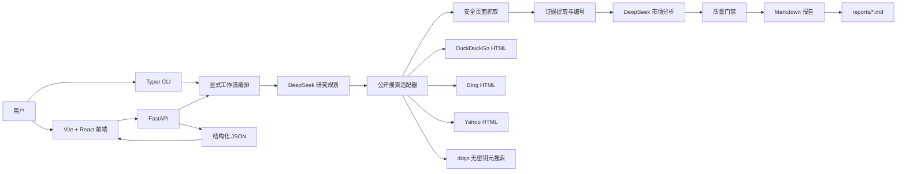
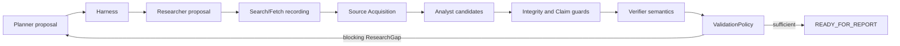

# MarketPulse Agent 架构、技术选型与工程化说明

## 1. 项目定位

MarketPulse Agent 是一个面向产品经理、创业团队和 SaaS 战略分析人员的市场研究 MVP。用户输入任意产品方向或关键词，系统自主完成公开网页搜索、候选页面读取、证据提取、市场分析和中文报告生成，并同时提供 CLI 与 Web 两种入口。

本项目刻意把“LLM 擅长的开放式推理”和“程序擅长的确定性控制”分开：

- DeepSeek 负责研究问题规划和基于证据的综合分析。
- Python 工作流负责阶段顺序、预算、联网、证据编号、质量门禁和文件写入。
- 报告中的事实必须可以追溯到成功读取的公开页面，搜索摘要只用于发现 URL。

MVP 不追求自动替代正式咨询，而是快速生成一份可讨论、可核验、能暴露证据不足的市场决策备忘录。

## 2. 系统全景



核心数据流：

```text
topic
  → ResearchPlan
  → SearchCandidate[]
  → FetchedPage[]
  → EvidenceBundle + CoverageSummary
  → MarketAnalysis
  → QualityResult
  → Markdown + Web JSON
```

## 3. 技术选型

| 层级 | 选型 | 选择原因 |
|---|---|---|
| 运行时 | Python 3.11+ | 原生异步、类型能力成熟，适合 Agent、HTTP 与 CLI 工作流 |
| 包管理 | uv | 安装和锁定速度快，以 `uv.lock` 保证依赖可复现 |
| Agent | OpenAI Agents SDK | 提供 Agent/Runner 抽象，同时允许注入 OpenAI 兼容客户端 |
| LLM | DeepSeek `deepseek-chat` | 使用 OpenAI 兼容 API，符合成本和模型约束 |
| HTTP | HTTPX | 原生 async、细粒度超时、重定向和异常分类 |
| HTML 解析 | Beautiful Soup | 对公开网页正文和搜索结果 HTML 做轻量解析 |
| 搜索回退 | DuckDuckGo、Bing、Yahoo、ddgs | 无需额外 API Key，通过多提供方降低单点失效 |
| 数据契约 | Pydantic v2 | 同时约束配置、阶段输入输出、LLM JSON 和 API Schema |
| CLI | Typer | 类型驱动参数、帮助信息和明确退出码 |
| 报告模板 | Jinja2 | 报告结构固定、内容可审计，避免完全交给 LLM 排版 |
| Web API | FastAPI + Uvicorn | 直接暴露 Pydantic 模型，复用 Python 工作流 |
| 前端 | Vite + React 19 + TypeScript | 轻量 SPA、开发反馈快、类型契约清晰 |
| UI | shadcn/ui Base UI + Tailwind CSS 4 | 组件源码在项目内，可访问性和样式可控 |
| 测试 | pytest + pytest-asyncio + Vitest + Testing Library | 后端异步分层测试与前端用户行为测试 |
| 静态质量 | mypy strict、Ruff、oxlint、TypeScript | 在运行前发现类型、导入和常见实现错误 |
| 打包 | Hatchling + `uv build` | 生成标准 wheel 与 sdist，CLI/API 都作为 console script 发布 |

## 4. 目录与模块边界

```text
marketpulse-agent/
├─ docs/                         # 需求、实现计划、验收、架构文档
├─ reports/                      # 生成的 Markdown 与验收截图
├─ src/marketpulse/
│  ├─ adapters/                  # 外部网络适配：搜索、robots、抓取
│  ├─ agents/                    # DeepSeek / Agents SDK 接入与提示词
│  ├─ domain/                    # 研究、证据、分析的 Pydantic 领域模型
│  ├─ services/                  # 可组合的业务步骤
│  ├─ templates/                 # 固定 Markdown 报告模板
│  ├─ budget.py                  # 时间、搜索次数、页面数量预算
│  ├─ cli.py                     # Typer 组合根与 CLI 入口
│  ├─ config.py                  # 环境变量配置
│  ├─ errors.py                  # 领域异常与稳定退出码
│  ├─ observability.py           # run_id、阶段日志、统计和脱敏
│  ├─ web_api.py                 # FastAPI 适配层
│  └─ workflow.py                # 七阶段显式编排
├─ tests/
│  ├─ unit/                      # 纯函数、适配器边界、预算与安全规则
│  ├─ integration/               # CLI、API 和离线完整工作流
│  └─ live/                      # 真实搜索与 DeepSeek 冒烟测试
├─ web/
│  ├─ src/components/ui/         # shadcn 组件源码
│  ├─ src/components/            # 报告展示和加载态
│  ├─ src/lib/                   # API 客户端和 TypeScript 数据契约
│  └─ src/MarketPulseApp.tsx     # 页面状态与用户交互
├─ .env.example
├─ pyproject.toml
├─ uv.lock
└─ README.md
```

边界设计原则：

- `domain` 不依赖网络与 UI，仅描述合法数据。
- `adapters` 封装不稳定的外部世界，不把 HTTP 细节泄漏到工作流。
- `services` 各自完成一个研究步骤，可通过 fake 依赖离线测试。
- `workflow` 只编排，不直接实现搜索、解析或模型调用。
- CLI 和 API 是两个组合根，共享同一个 `run_marketpulse`，避免业务逻辑分叉。

## 5. 七阶段工作流

### 5.1 Plan：研究规划

`services/planner.py` 先验证并规范化主题，再请求 DeepSeek 返回 `ResearchPlan`：

- 原始主题与规范化主题；
- 3–8 个研究问题；
- 4–12 个唯一搜索查询；
- 每个查询带 `demand / competitor / product / pricing / trend` 意图。

规划由 LLM 完成，但结果必须通过 Pydantic 验证，重复查询会直接判为无效结构。

### 5.2 Search：候选发现

`PublicSearchClient` 对每个查询保留一次搜索预算，并按以下路径回退：

1. DuckDuckGo HTML；
2. Bing HTML；
3. Yahoo HTML；
4. `ddgs` 无密钥元搜索。

工程细节：

- 搜索请求单次最长 5 秒，避免多个提供方的重试累积耗尽 300 秒全局预算。
- 连接或读取超时后立即切换下一提供方。
- 429、502、503、504 等明确的瞬时状态仍执行指数退避重试。
- 解码 DuckDuckGo、Bing、Yahoo 的包装链接，再执行 URL 规范化。
- 删除 `utm_*`、`gclid`、`fbclid` 等跟踪参数并按规范化 URL 去重。
- Bing/Yahoo/ddgs 结果通过查询词相关性过滤，减少搜索引擎返回的泛化噪声。
- HTML 搜索全部不可用时才进入 `ddgs`；所有路径失败才产生 `SearchUnavailableError`。

### 5.3 Fetch：安全抓取

`PageFetcher` 并发读取候选页面，默认最多 24 页、并发 5：

- 读取前检查 robots.txt；
- 仅接受 HTTP(S)；
- 拒绝带用户名/密码的 URL、localhost、私网与非全局 IP；
- 限制为文本类内容，拒绝二进制下载；
- 单页最大 2 MiB；
- 最多重定向 5 次，并对最终地址再次约束；
- 单页失败降级为 warning，不中止整次研究；所有页面失败才终止。

部分透明代理会把公网 DNS 映射到 `198.18.0.0/15`。项目提供默认关闭的 `MARKETPULSE_ALLOW_PROXY_DNS`：只有显式启用时才接受这一基准测试网段，localhost 和其他私网仍被拒绝，从而兼顾代理兼容性与 SSRF 防护。

### 5.4 Extract：证据提取

正文提取会移除脚本、样式、导航等噪声，再按页面生成：

- `Source`：`S1`、`S2` 等稳定来源编号；
- `EvidenceClaim`：`C1_1` 等事实编号；
- claim 类型、主题、陈述和短引用；
- `CoverageSummary`：来源、官方来源、事实和定价事实数量。

`EvidenceBundle` 的模型校验确保每条 claim 都引用已知 source。报告不直接采用搜索摘要，因此引用的事实来自实际抓取正文。

### 5.5 Analyze：DeepSeek 分析

分析输入为经过裁剪和编号的证据，而不是完整网页。模型输出 `MarketAnalysis`：

- 执行摘要、市场信号；
- 竞品定位、客群、能力和定价；
- 机会、阻力、风险；
- `Go / Conditional Go / No-Go`；
- 0–1 置信度、判断依据、下一步和研究限制。

每项市场信号和竞品结论必须携带 `source_ids`。竞品列表最多 5 个，避免报告为了“凑数量”扩大无证据结论。

### 5.6 Quality：质量门禁

质量规则分为阻断和降级：

- 没有来源：致命，拒绝生成报告；
- 少于 8 个来源：覆盖警告；
- 少于 3 个官方来源：覆盖警告；
- 少于 3 个有证据竞品：覆盖警告；
- 没有定价事实：覆盖警告。

非致命问题不会丢弃已经取得的研究结果，而是进入报告和 Web 页面，提醒用户降低决策权重。

### 5.7 Write：确定性报告输出

Jinja2 模板把结构化对象渲染成固定 10 章节中文 Markdown。文件通过临时文件替换方式原子写入，避免异常中断留下半份报告。CLI 输出报告路径、run_id、来源数量和覆盖提示；API 同时返回 Markdown 与结构化数据。

## 6. DeepSeek 与 Agents SDK 集成

`agents/factory.py` 是模型接入的唯一边界：

```text
Settings
  → AsyncOpenAI(base_url=https://api.deepseek.com)
  → set_default_openai_client(..., use_for_tracing=False)
  → set_default_openai_api("chat_completions")
  → set_tracing_disabled(True)
  → Agent + Runner.run
```

关键处理：

- API Key 仅从 `DEEPSEEK_API_KEY` 读取，代码和日志不保存明文。
- 使用 DeepSeek 支持的 Chat Completions，而不是 OpenAI 托管搜索工具。
- Agents SDK tracing 完全关闭，避免尝试连接 OpenAI tracing 服务。
- LLM 被要求返回与 Pydantic JSON Schema 匹配的单个对象。
- 可处理纯 JSON、Markdown JSON fence 和前后带少量说明的响应。
- 第一次结构验证失败时，将错误反馈给模型修复一次；连续两次失败转成领域错误。
- 单次 Agent 执行被局部超时包围，同时受工作流全局预算限制。

## 7. 预算、超时与退化策略

默认预算：

| 维度 | 默认值 |
|---|---:|
| 总运行时限 | 300 秒 |
| 最大搜索查询 | 12 |
| 初始规划查询上限 | 8 |
| 最大抓取页面 | 24 |
| 页面超时 | 15 秒 |
| 搜索单请求上限 | 5 秒 |
| 抓取并发 | 5 |
| 瞬时错误重试 | 2 次 |
| 单页内容上限 | 2 MiB |

`RunBudget` 使用单调时钟记录 deadline，并在每个阶段、每次搜索和每次页面读取前预留预算。这样即使外部服务卡住，也能把错误稳定映射为超时，而不是无限等待。

退化顺序遵循“保住可解释结果”：

- 单搜索提供方失败 → 切换提供方；
- 单页面失败 → 记录 warning 并继续；
- 来源偏少 → 生成低置信度报告并显示警告；
- 无候选、无正文证据或致命质量问题 → 明确失败，不让 LLM 凭空补全。

## 8. CLI 与错误契约

Typer CLI 是最小、可脚本化入口：

```powershell
uv run marketpulse --output reports/example.md --log-file logs/run.jsonl "AI meeting notes software"
```

稳定退出码使 shell、CI 或上层调度器能够区分问题：

| 退出码 | 含义 |
|---:|---|
| 0 | 成功 |
| 2 | 输入无效 |
| 3 | 配置或密钥缺失 |
| 10 | 搜索不可用 |
| 11 | 无可用证据或分析结构无效 |
| 12 | 总时限或预算耗尽 |
| 13 | 报告写入失败 |
| 20 | 未预期内部错误 |

CLI 不输出堆栈或密钥，只提供可操作的中文错误；详细阶段信息可写入 JSONL。

## 9. FastAPI 适配层

FastAPI 提供两个接口：

- `GET /api/health`：运行状态。
- `POST /api/reports`：输入主题和竞品上限，运行完整工作流。

API 不复制 CLI 逻辑，而是重新组装相同的 `WorkflowDependencies` 并调用 `run_marketpulse`。响应包含分析、覆盖、来源、质量、统计、warning 和原始 Markdown，前端不需要再次解析 Markdown。

Agents SDK 的默认客户端是进程全局状态。MVP 使用 `_run_lock` 串行化 Web 请求，避免并发请求互相替换或关闭 client。这牺牲吞吐量，但让单机演示具有确定性；生产化应改为隔离 worker 或移除全局 client 依赖。

领域错误统一映射为 4xx/5xx：输入和证据问题返回 422，搜索问题返回 502，配置问题返回 503，超时返回 504。

## 10. 前端架构与信息设计

前端只负责输入、运行状态和结构化展示：

```text
MarketPulseApp
  ├─ 关键词表单
  ├─ loading / error / empty 状态
  └─ ReportView
       ├─ 核心结论 Tab
       ├─ 市场概览 Tab
       ├─ 竞品对比 Tab
       ├─ 定价区间 Tab
       ├─ 证据来源 Tab
       └─ 行动建议 Tab
```

界面技术细节：

- Vite 开发服务器把 `/api` 代理到 `127.0.0.1:8000`，开发环境不需要前端持有密钥。
- API 返回对象在 `lib/types.ts` 中建立对应 TypeScript 类型。
- 加载态展示阶段感知的进度文案和 skeleton，不让长任务看起来像页面失效。
- 报告保留原有内容，但通过 shadcn `Tabs` 分为六个任务导向页面；默认只呈现核心结论，明显缩短首屏。
- Tabs 遵循 Base UI 的 ARIA 和键盘交互；移动端入口横向滚动，不压缩成难读的多行按钮。
- 竞品表在窄屏内部横向滚动；证据来源使用 Accordion 按需展开。
- 视觉语言保持浅色、克制、专业：Manrope 承担产品界面，Source Serif 4 用于长摘要；结论色只服务 Go 状态，不作为装饰。

## 11. 安全与隐私处理

- Key 不进入代码、报告、前端 bundle 或日志。
- `.env.example` 仅提供占位值；应用不会自动加载 `.env`，降低误提交凭据风险。
- URL 接受前和重定向后都做协议、凭据、主机与 IP 检查。
- 抓取遵守 robots.txt，并限制 MIME 与大小。
- 外部网页仅作为数据读取，不把网页中的指令当作 Agent 指令。
- 搜索结果 URL 去跟踪参数，减少无意义重复和隐私泄露。
- JSONL 日志通过 `redact_sensitive` 对敏感字段脱敏。
- 报告链接使用 `target="_blank"` 时同时设置 `rel="noreferrer"`。

## 12. 可观测性

每次运行生成唯一 `run_id`，阶段事件采用 JSONL 记录：

```text
plan → search → fetch → extract → analyze → quality → write
```

`RunStats` 记录搜索次数、候选数、成功/失败页面、来源数和 warnings。日志只记录阶段、计数和错误分类，不保存模型隐藏推理。Web API 对领域错误写 warning，保留错误码和可读信息。

## 13. 测试与交付门禁

### 13.1 测试分层

- Unit：URL 规范化、搜索回退、超时/重试、SSRF、正文提取、模板、预算、配置和 JSON 修复。
- Integration：使用 Fake Agent/Search/Fetcher 跑完整离线工作流，并验证 CLI 与 FastAPI 契约。
- Live search：真实调用公开搜索，验证至少返回一个 HTTP(S) 结果。
- Live workflow：真实搜索、抓取、DeepSeek 分析和 Markdown 写入。
- Frontend：Testing Library 从用户角度提交关键词并逐个切换六个 Tabs。

live 测试默认跳过，只有设置 `RUN_LIVE_TESTS=1` 才运行，避免日常开发意外产生费用或受外网波动影响。

### 13.2 质量命令

```powershell
uv run mypy src
uv run ruff check src tests
uv run pytest -m "not live" -q
uv build --clear

cd web
npm test
npm run lint
npm run build
```

交付前再显式注入用户级 DeepSeek Key，执行 `uv run pytest -q` 覆盖 live 套件。

## 14. 关键权衡

### 显式编排而不是完全自治 Agent

好处是预算、阶段、错误和证据链可预测；代价是新增研究阶段需要修改工作流。对需要审计的市场报告，这一权衡优于让 Agent 自由决定工具循环。

### 无密钥公开搜索而不是商业 Search API

满足零额外凭据和快速演示，但稳定性、地区一致性和服务等级较弱。因此必须把多提供方回退、短超时和结果过滤视为核心工程，而不是附加功能。

### 结构化 JSON + 固定模板而不是直接生成 Markdown

增加了 Schema 维护成本，却让 CLI、API 和 React 能共享同一分析对象，也能在渲染前执行引用和质量验证。

### Web 请求串行而不是并发

解决 Agents SDK 全局客户端生命周期冲突，适合单机 MVP；不适合多用户生产吞吐。

## 15. 已知限制与演进方向

当前限制：

- 公开搜索可能被限流、挑战或改变 HTML。
- 市场规模和历史数据常位于付费数据库，公开来源覆盖有限。
- 页面正文提取是通用规则，不处理复杂 SPA、登录页和 PDF 深度解析。
- Web 请求同步等待 1–5 分钟，无后台队列、取消和断点恢复。
- 没有账号、鉴权、配额、报告数据库与多租户隔离。
- 前后端类型目前手工同步，尚未从 OpenAPI 自动生成。

推荐演进顺序：

1. 把报告运行放入独立 worker，引入任务状态与 SSE 进度推送。
2. 对搜索提供方记录成功率、延迟和回退次数，增加熔断。
3. 引入浏览器渲染与 PDF 解析作为可选抓取器，而非替换轻量 HTTP 路径。
4. 从 FastAPI OpenAPI 自动生成 TypeScript client 和类型。
5. 增加来源权威度、发布日期和定价口径的结构化评分。
6. 再补认证、限流、密钥托管、持久化与生产部署。

## 16. 一次请求的端到端示例

```text
用户输入 "AI meeting notes software"
  1. CLI/API 校验输入并创建 run_id、预算、HTTP client、Agent runner
  2. DeepSeek 规划 demand / competitor / pricing / trend 查询
  3. 搜索适配器按提供方回退并规范化候选 URL
  4. 抓取器并发读取允许访问的公开正文
  5. 提取器建立 S* 来源和 C* 事实索引
  6. DeepSeek 只基于证据输出 MarketAnalysis JSON
  7. 质量门禁标记来源、官方来源和定价覆盖不足
  8. Jinja2 原子写入中文 Markdown
  9. FastAPI 返回同一份结构化分析
 10. React 默认展示结论，用户通过 Tabs 查看市场、竞品、定价、证据和行动
```

这套结构的核心不是“让模型搜索并写文章”，而是让模型在受预算、数据契约、证据引用和质量规则约束的工程流程中完成它最擅长的规划与综合判断。

## 17. Investigation Phase 4.3 Agent Feedback Loop

新调查主链位于 `marketpulse.investigation`，与上述旧市场工作流并存。四个 ModelPort-backed Agent 只返回严格 Pydantic proposal：Planner 决定调查任务，Researcher 提出查询，Analyst 提出 Evidence/Claim/关系/冲突候选，Verifier 只提出语义蕴含判断与缺口。Agent 不能调用工具、写数据库 lifecycle、设置最终 ValidationStatus 或决定发布。



每个 Agent 的 system prompt、bounded context 和 response schema 分离。外部内容只在 user context 中以 `UNTRUSTED_SOURCE_DATA` 标识。`AgentContextBuilder` 按角色裁剪问题、任务、来源 family、artifact excerpt、Claim、冲突、gap 和剩余预算，并对规范化 context 计算 fingerprint。Artifact selector 使用确定性优先级和 artifact/excerpt/字符上限，不把整个数据库或全文集合交给模型。

网络与模型执行不持有数据库事务。Step 开始和外部调用录制可先独立持久化；完成时由短 UnitOfWork 原子写入业务输出、typed transaction operations、Step COMPLETED 与 Run checkpoint/state version。ValidationResult、ResearchGap、conflict/family relations 及 Claim latest projection通过 in-session persistence 加入同一完成事务。

RunBudget 持久化轮次、Search/Fetch/Model 调用、tokens、sources 和 active execution time。每轮计算新来源/family/Evidence/Claim、gap 和 conflict 变化以及 Validation status 变化；连续配置轮数无信息增益时以 `NO_INFORMATION_GAIN` 停止。预算耗尽、证据不足和未解冲突进入保留证据链的 `BLOCKED`，不会转换成 VERIFIED。

Trace resolver 支持 `Claim → ValidationResult → Relation → Evidence → Snapshot → Artifact locator → Source`，以及 `Claim → Analysis Step/ModelCall → ResearchTask → Researcher ModelCall/SearchCall`；返工链可从 ValidationResult 追到 ResearchGap 与 follow-up ResearchTask。Replay 只复用精确匹配的 Model/Search/Fetch 录制，在新 Run 中重建 Step 和业务对象，并重新运行 ValidationPolicy。

本阶段终止于 `READY_FOR_REPORT` 或可解释停止，仅形成 `InvestigationSummary` / `ReportInput`。完整 Writer、release policy、Reviewer 授权、OCR、分布式队列、新前端和最终发布验收不在 Phase 4.3 范围内。
