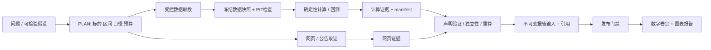
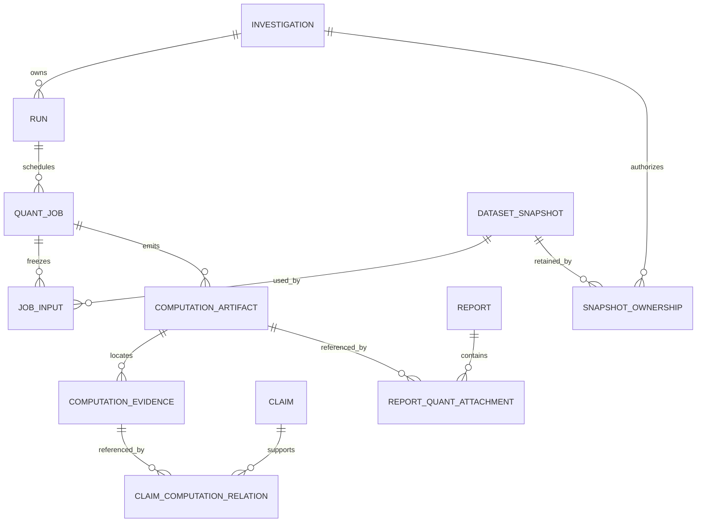
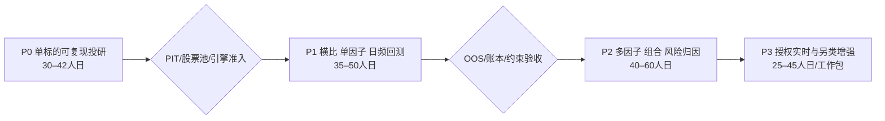

# AI 量化投研 Agent 完整演进方案

版本：L-1.0 · 2026-10-04 · 项目：`D:\deepsearch`（根目录 Search-Report / marketpulse-agent）

状态：规划与可行性调研交付，待评审；本轮没有实现业务功能。下文“新增/修改”均为未来开发建议，不代表已经落地。代码核实针对当前工作区，包含此前任务的未提交改动，不针对嵌套的 `Search-Report/` 副本。

## 目录

1. [结论与最小起步](#1-结论与最小起步)
2. [现状核实与复用矩阵](#2-现状核实与复用矩阵)
3. [目标架构与能力分层](#3-目标架构与能力分层)
4. [数据源对比与合规](#4-数据源对比与合规)
5. [真实 spike 与可行性边界](#5-真实-spike-与可行性边界)
6. [数据口径与跨市场规则](#6-数据口径与跨市场规则)
7. [存储版本与数据模型](#7-存储版本与数据模型)
8. [模块文件与接口草图](#8-模块文件与接口草图)
9. [Agent 工具编排与预算](#9-agent-工具编排与预算)
10. [量化验证与可信度门禁](#10-量化验证与可信度门禁)
11. [指标因子回测与风险计算](#11-指标因子回测与风险计算)
12. [HTTP 增量契约](#12-http-增量契约)
13. [图表与投研报告](#13-图表与投研报告)
14. [P0–P3 路线图与排期](#14-p0p3-路线图与排期)
15. [验收测试与演示](#15-验收测试与演示)
16. [工程风险与防护](#16-工程风险与防护)
17. [依赖版本与自研边界](#17-依赖版本与自研边界)
18. [交付核验与评审决策](#18-交付核验与评审决策)

## 1. 结论与最小起步

可行，但应先做“有数据血缘的单标的研究”，不是先做全市场选股或自动交易。现有优势在证据、发布门禁、预算、录制回放与卷宗；欠缺的是证券主数据、结构化行情/财务快照、确定性计算执行、计算证据与图表。把 DataFrame 塞进网页证据、让模型自行算数，会破坏现有可信边界。

建议 P0：A 股沪深普通股票，单标的、日频、最多近三年；用户输入“截至某日，该公司的估值与基本面如何”。输出价格/回撤、收益和波动、PE/PB 与财务趋势、公告/新闻证据、可确认与不能确认的结论，以及可离线重算的卷宗。一页是阅读摘要，不是强行把溯源附录压在同一屏。暂不做选股、实盘、实时数据、自动下单、全市场因子、目标价预测和优化器。

起步组合：BaoStock 日线/估值/季度字段和复权因子；AkShare 腾讯日线交叉检查，AkShare 新浪财务摘要/东方财富估值作为补充；公告沿用现有网页/PDF 取证。东方财富接口不宜成为唯一依赖。Tushare Pro 在取得所需积分/授权后作为稳定性升级选项，不能自动使用用户尚未授权的账户。研究内测与商用数据授权分别设门禁。估计 P0 **30–42 人日**（含测试、门禁和约 20% 缓冲，不含采购/法律审核等待）。

当前 spike 证明免费链能够取数，不能证明完整 PIT 或商用合法：AkShare/腾讯与 BaoStock 各返回 19 天原始日线；BaoStock 有 `pubDate` 财务字段；新浪摘要没有发布日期；首次 13 个探针 10 成功，追加 3 个探针 2 成功，失败保留。完整记录见[spike 说明](spikes/task_l/README.md)。因此 P0 可以做“当前已披露基本面”的研究；涉及历史时点估值的回答必须先满足 PIT，不能从当前摘要反推历史。

## 2. 现状核实与复用矩阵

代码事实：Python 要求 `>=3.11,<3.14`，业务环境为 3.13.13；FastAPI/SQLAlchemy/SQLite，Vue3/Vite5/GSAP。现有依赖未包含 pandas、NumPy、DuckDB、Arrow、回测或图表库。模型通过 OpenAI 兼容端口及阶段路由调用；量化升级不要求更换 DeepSeek 或重写编排。

以下路径相对于根目录；`I = src/marketpulse/investigation/`，`Q = src/marketpulse/quant/`（Q 全部尚不存在）。可直接复用指复用机制，不等于任何新对象可以零改动穿过其类型/哈希边界。

|能力/现有文件|判定|代码核实与未来动作|
|---|---|---|
|`I/feedback/orchestrator.py`|复用状态机、需增量接入|`AgentFeedbackOrchestrator` 的 PLAN→COLLECT→ANALYZE→VERIFY→REPORT，预算预约/追问/无进展停止保留；插入量化任务分支，不改旧网页任务语义|
|`I/live_runtime.py`|复用收尾、需注册 worker|`_execute/_finalize_run/_report` 超时/取消收尾，30 秒报告保留，普通/紧急报告各有有界重试；只有报告持久化才结束。量化 worker 取消后也走同一终态|
|`I/depth.py`|直接复用时长、扩展资源配额|quick 300s / standard 600s / deep 1800s；三档 rounds=1/3/6、queries=12/48/120、pages=32/80/160、model calls=40/120/240、tokens=30万/100万/200万；量化 CPU/行数/取数调用新增独立上限，不消耗网页 page 计数冒充|
|`I/harness/calls.py`, `recording/adapters.py`, `ports/external.py`|机制复用、类型改造|当前 SearchPort/FetchPort/ModelPort 及 BoundExternalCalls，不含行情端口；新增 QuantDataPort 录制适配器，沿用 logical key、ordinal、attempt、预算、回放。不能直接裸调 SDK 绕过记录|
|`I/harness/model_routing.py`, `model_retry.py`, `stage_budget.py`|直接复用|分阶段路由、重试与预算，仅把模型用于计划/解释/网页语义，不用于计算主结果|
|`I/services/source_acquisition.py`, `adapters/fetch.py`, `ingestion/`|网页部分直接复用|多后端搜索、网页/PDF、退避/正文/安全边界；量化 SDK 自带网络不会自动获得这些保护，需新增受控进程/域名限制|
|`I/agents/contracts.py`, `agents/normalization.py`|需增量契约|现有 frozen/extra-forbid 的 PlanProposal、ClaimCandidate、EvidenceCandidate 依赖网页摘录；新增 QuantPlanSpec，不放松旧验证器，不允许模型提交任意 Python/SQL|
|`I/domain/claims.py`, `domain/enums.py`|声明状态直接复用|继续使用 QUANTITATIVE 与 VERIFIED/PROBABLE/UNVERIFIED；qualifiers 保存 value/unit/time/scope/definition/methodology；新计算状态不替代声明状态|
|`I/domain/sources.py`, `domain/locators.py`|不可直接承载数据，需新对象|Source 的 canonical_url 是 HTTP URL，Evidence 是文本；locator 仅 TextRange/PdfTextRange。新 DatasetSnapshot/ComputationEvidence 引用坐标，不能把 Parquet 路径伪装网页 URL 或摘录|
|`I/validation/policy.py`, `profiles.py`|旧政策复用、新分支加严|现有 15 阶段且 QuantitativeProfile 检查口径、精确 ENTAILS、质量、独立来源族与冲突；高/关键重要性需要 2 族、普通 1 族。新增计算证据完整性/重算门禁，旧行为保持|
|`I/validation/lineage.py`, `independence.py`, `quality.py`, `entailment.py`|思想复用、输入扩展|族不是 URL 数；原始上游共同数据不能因换库独立；网页语义判定不能证明计算正确。对数值证据新设确定性验证，网页仍原样运行|
|`I/reporting/assembler.py`, `models.py`, `hashing.py`|需 v2 扩展|ReportInputAssembler 是 Phase5 唯一状态读取入口，快照 frozen/content-addressed；新增量化语义材料必须进入新域哈希，旧 v1 内容/哈希不变|
|`I/reporting/citations.py`, `validation.py`, `release.py`|严格扩展，不绕过|CitationFactory 依赖真实链、SUPPORTS+ENTAILED、文本定位、最新验证；增加计算引用分支和核验，旧引用不变；报告发布仍由确定性 policy 决定|
|`I/reporting/chinese_writer.py`, `writer.py`, `pipeline.py`, `renderer.py`, `persistence.py`|组织方式直接复用、增量模板|现有 compact、answer-first、空章删除、局限聚合/附录；追加投研块与图表资产哈希，数值只读产物，技术诊断只在折叠附录|
|`I/persistence/models.py`, `repositories.py`; `migrations/versions/`|元数据基础复用、新表迁移|不要把数百万行行情写入现有 EvidenceRow。新 inv_quant_* 元数据和外部列式 blob，旧表向后兼容|
|`src/marketpulse/infrastructure/storage/local.py`, `models.py`, `ports.py`|内容寻址机制复用|存 raw/normalized Parquet/JSON/PNG，保留 SHA256；数据仓与 blob 元数据明确所有权、共享引用|
|`I/deletion.py`|必须扩展|现有只处理 inv_ 表和引用 GC，活跃运行/报告收尾禁止删。新表名/外键登记、授权导出、共享快照保护和量化缓存 GC 都需测试|
|`I/api.py`, `server.py`, `recovery.py`|兼容增量|保留旧创建/运行/取消/恢复/报告/引用接口；量化独立路由和 sidecar，不替换老接口 JSON|
|`frontend/src/components/ReportDetail.vue`, `utils/reportPresentation.js`|复用布局、增量块|已有正文/折叠附录、引用预览、报告版本/阅读进度、GSAP reduced-motion。新增 QuantChart/计算证据弹窗，不复写旧报告|
|`frontend/src/composables/useInvestigation.js`, `api/topicInvestigation.js`|需新入口和 sidecar|已有轮询/请求版本保护，topic 默认生成一般研究问题；新增 QuantResearchForm 与 useQuantArtifacts，旧调查入口照常|
|`frontend/src/styles/tokens.css`, `composables/useTheme.js`, `utils/motionTokens.js`|直接复用|主题/token/动效偏好统一；不引入第二套 UI 框架|

### 2.1 编排平移



新增的是取数/计算证据支路，不是替换网页支路。报价上涨是观察事实，“因某新闻导致上涨”是因果声明，后者仍需因果证据，不能由相关系数或模型解释自动升级。

## 3. 目标架构与能力分层

|层|P0|P1|P2/P3|输入→产物|
|---|---|---|---|---|
|数据|证券标识、日线、复权/财务/估值、公告新闻|历史股票池/行业/基准/PIT|授权分钟/盘口、另类、跨市场|DataRequest→DatasetSnapshot；始终记录供应商/上游/定义|
|投研计算|收益、波动、回撤、PE/PB、财务同比、均线|Sharpe/Sortino、Beta、相关性、估值横比|风险模型/敏感性|MetricSpec+冻结快照→MetricResult|
|因子策略|不做|Rank IC/IR、分层、单因子/长仓规则|多因子、训练/验证/滚动|FactorSpec→因子面板/检验/实验登记|
|回测|仅价格走势，不标“策略净值”|日频长仓，无融资/卖空；向量化筛查+事件确认|组合/调仓/更细执行|BacktestSpec+MarketRuleSet→账本/净值/诊断|
|组合风险|单标的风险提示|简单等权组合分析|行业/风格中性、协方差收缩、约束优化、归因|Holdings+ExposureSpec→RiskResult|
|Agent|结构化意图+白名单工具|多任务预算/实验检索|更大工作流而非更大自由执行权限|PlanSpec→工具任务 DAG/声明|
|报告可视化|价格/回撤/财务趋势、摘要|净值/IC/分层/相关热图|敞口/归因/情景图|ArtifactBundle→固定图表 schema/报告|

分层原则：外部数据适配不和模型混写；纯计算模块没有网络或数据库副作用；持久化只在服务层提交；所有大计算在子进程，FastAPI event loop 不跑 pandas/SDK 同步函数；不存在自动交易工具。

## 4. 数据源对比与合规

调研截至 2026-10-04。额度/价格/权限以供应商当期账户和合同为准；“免费/无 key”不表示无限请求或商用授权。稳定性列是接口形态与本轮观测的工程判断，不是 SLA 排名。未持有账户的付费接口只核官方资料，未宣称 live 通过。

|源|市场 / 字段口径|免费/权限/注册|更新与可用性|授权、稳定性及建议|
|---|---|---|---|---|
|AkShare|A/HK/US、行情/财务/新闻等，逐接口覆盖不同；EM/腾讯 raw/qfq/hfq；新浪摘要报告期宽表|库免费、通常公开网页接口无账户；无统一保证额度|日线、实时、季度混合，取决上游；SDK 更新较快|库 MIT ≠ 上游数据许可；内测限制速率/缓存。实测 EM 部分失败、腾讯可取；作适配集合，不当独立数据供应商。[接口文档](https://akshare.akfamily.xyz/data/stock/stock.html)、[许可证](https://github.com/akfamily/akshare/blob/main/LICENSE)|
|Tushare Pro|A 股 daily、adj_factor、daily_basic、财报 ann_date/end_date；HK/US 部分另开权限|注册/token；daily 官方列 120 积分，复权/估值及主要财务一般 2000 积分；积分是权限门槛而非每次调用扣积分|A 股日线一般交易日收盘后更新；限频按积分/API|结构化契约优于网页抓取，但无此账户实测；部分接口独立付费，商业/再分发须书面确认。可作生产升级主源。[积分表](https://tushare.pro/document/1?doc_id=108)、[限频](https://tushare.pro/document/2?doc_id=290)、[pro_bar](https://tushare.pro/document/1?doc_id=109)|
|BaoStock|沪深 A 股日线、raw/qfq/hfq、停牌/ST/PE/PB、季度 pubDate/statDate；本轮未验证北交所/HK/US|SDK 免费、匿名 login，无 token；没有可据以承诺的统一 SLA/无限额度|日频/季度，不作为实时主源；字符串和空串多|软件包声明 BSD，具体版本附带许可与上游数据许可均需审核；登录/长连接需串行 worker。初测一次登录失败，复测成功。P0 首选之一。[官方入口](https://www.baostock.com/)、[官方分发包](https://pypi.org/project/baostock/)|
|yfinance / Yahoo|US/HK 等全球报价、分红拆股、部分财务；中国覆盖不能替代 A 股专源|无统一 API key、通常不用注册；并非授权官方市场 API|日线/部分分钟，窗口/限流变化，不保证历史财务 PIT|库 Apache-2.0；项目明确 Yahoo 数据偏个人研究用途，商用另获授权。不作为商用免费默认。P1 HK/US 本地探索选项。[项目说明](https://github.com/ranaroussi/yfinance)、[分发信息](https://pypi.org/project/yfinance/)|
|Polygon → Massive|重点 US 股票 OHLCV/参考/公司行动；财务与实时数据按产品区分，split-adjusted 不自动是 dividend total-return|注册/key；Stocks Basic 官方为 5 calls/min、2 年历史、EOD；更多历史/实时/业务用途另购|供应商 API，付费条款可明确稳定性；免费 2 年不满足默认 3 年回测|2025-10-30 品牌改名，旧 Polygon 命名不要成为新架构依赖；个人套餐不等于商用展示许可。US 生产优先合同源。[改名](https://www.massive.com/blog/polygon-is-now-massive)、[价格](https://massive.com/pricing)、[数据产品](https://massive.com/stocks)|
|Alpha Vantage|全球股票原始/复权日线、股息/拆股、部分 fundamentals/指标；逐证券核覆盖|注册/key；标准免费 25 请求/日；DAILY_ADJUSTED 文档标 premium，不能当免费备用承诺|频率/字段按端点套餐；低额度不适合股票池|适合 US 单标的低频补充，商业授权按条款；用预算/缓存，防免费接口 HTTP200 返回限额文本误判数据。[额度](https://www.alphavantage.co/support/)、[接口](https://www.alphavantage.co/documentation/)|
|Sina / Eastmoney / 腾讯公开网页|A/HK 等行情、估值、财务与新闻；接口/字段易变|通常公开无 key，但没有标准开发者套餐或默认商业再分发授权|日线/实时/公告，不同端点发布时间和精度不同|AkShare 使用它们只是 SDK 包装；不要再计一族。需 terms/robots/合同逐项核，不绕过访问控制。无授权的公开服务仅研究内测候选。[新浪财务页](https://vip.stock.finance.sina.com.cn/corp/go.php/vFD_FinanceSummary/stockid/000001.phtml)、[EM 估值页](https://data.eastmoney.com/gzfx/detail/000001.html)|
|交易所/公司公告、SEC EDGAR|A/HK 公司原文/公告；US submissions/companyfacts 与 filing/accession|官网公开不等于可批量再分发全文；SEC API 无 key，要求 fair access|公告事件驱动；财报 period/date/filed 分离|作为财务原文校核，不是网页抓取价格源；SEC 服务端获取、标识 UA、低于官方总计 10 请求/秒上限。[SEC API](https://www.sec.gov/search-filings/edgar-application-programming-interfaces)、[访问规范](https://www.sec.gov/about/developer-resources)|

### 4.1 推荐降级链与独立性

行情：已冻结且可用快照 → BaoStock → AkShare 腾讯 → AkShare EM（电路未开时）→ 已授权 Tushare。不是自动混合拼接：每段记录 provider/upstream/asof/调整口径，切源后重做标准化及重叠核对；冲突不平均，暂停相关声明发布。回测输入缺日不以新闻价格或模型生成值补齐。

财务：BaoStock 发布日期记录 + 公司原文 → 已授权 Tushare 财报 → AkShare 新浪/EM 补充当前研究；没有 ann_date/pubDate 与历史版本的补充源禁止给出历史 PIT 标签。估值：BaoStock 历史 PE/PB ↔ EM 同日同定义；缺 EPS/股数/盈利定义时只报告供应商估值，不伪称已自行复算。公司公告用于校验报表值，不把自己从同一公告计算出的数再计第二独立来源。

市场扩展：HK 用获许可 HK 数据商/交易所公告与 HKEXnews，yfinance 仅研究测试；US 用 Massive 合同报价 + SEC 原文，Alpha Vantage 或个人研究 yfinance 降级。免费源覆盖/权利不能按 A 股方案复制过去。

建立 `DataRightsPolicy`：provider、产品/市场、账号 entitlement、允许内部计算/展示衍生值/分享图表/导出原始数据、保存时限、attribution、合同版本/到期。未知权限默认禁止对外分享与 raw export；内部研究也需确认条款，不以免责文案替代授权。上线付费投研服务前另评估证券研究/投资咨询、宣传、隐私与商业许可，本文不是法律意见。

## 5. 真实 spike 与可行性边界

本轮仅在 `docs/spikes/task_l/.venv` 安装探针依赖，业务 `pyproject.toml/uv.lock` 未改。脚本/输入/产物/失败与时间记录见 [README](spikes/task_l/README.md) 和 [summary](spikes/task_l/results/summary.json)、[复测](spikes/task_l/results/recheck.json)。本轮没有生成真实投研报告或跑策略回测，不能把连通性成功写成投研 MVP 已完成。

|实际验证项|结果|设计影响|
|---|---|---|
|AkShare 腾讯原始/前/后复权|各 19 行；date/open/close/high/low/volume/turnover/amount|可作免费日线备用，显式规范日期与单位|
|AkShare EM 前/后复权|各 19 行；日期/股票代码/OHLC/成交量/成交额/振幅/涨跌幅/涨跌额/换手率|两平台该样本 qfq 收盘价一致，不证明上游独立|
|AkShare EM 原始、利润表|原始首次 timeout、复测远端断开；利润表历史分页 timeout|必须留 timeout/circuit/fallback，不能认为可保证取全|
|AkShare EM 估值|2,123 行，13 列：日期、价格、市值、股数、PE(TTM/静)、PB、PEG、PCF、PS 等|可取历史估值，但未证明历史值当时可知/未重算|
|AkShare 新浪摘要|80 个指标行、选项/指标/20260630…报告期列，无公告时点列|转长表；当前摘要校核，不用于历史 PIT 因子|
|BaoStock 日线|raw/hfq 首次、qfq 复测各 19 行；18 列含 tradestatus/isST/peTTM/pbMRQ|主候选有可交易状态；必须将字符串/空串解析为类型|
|BaoStock 2024Q1 利润|1 行、11 列，pubDate 2024-04-20、statDate 2024-03-31、净利 149.32 亿元、epsTTM 2.410862|发布日期与期末分离；不证明修订档案完整|
|BaoStock 复权因子|1 行：code/dividOperateDate/foreAdjustFactor/backAdjustFactor/adjustFactor，事件日 2024-06-14|需要因子 asof/锚定、事件时点，不只保存“qfq=true”|
|离线 Arrow/DuckDB|12 个成功 Parquet SHA256 与行数验证通过|3.13 环境最小列式读写可用；不是完整业务兼容测试|

19 天腾讯/BaoStock 原始 close 最大差 0；volume 比值中位数 99.9999949，turn/turnover 中位数 100.032258（舍入）。EM/腾讯 qfq close 最大差 0。BaoStock 银行 `gpMargin/MBRevenue` 为空，不置零。首个离线检查发现 merge 两侧日期 dtype 不一致，探针显式规范双方日期后通过。这些是真实字段陷阱，不是抽象风险。

限制：1 个沪深银行股票、一个历史窗口/季度、同一天网络观测，未测全股票池、退市/北交所、财报更正、三年 SLA、商用许可、模型报告整链。应在 P0 第一周扩展 3 个普通沪深标的（银行/制造/消费）和分红窗口；在 P1 前采购或验证 PIT/历史股票池。免费源不满足时缩范围，不补造数据。

## 6. 数据口径与跨市场规则

### 6.1 时间、证券身份与 PIT

`instrument_id` 不能只是六位股票代码：用内部稳定 ID，别名含 exchange+code+valid_from/to；HK 代码补零，US ticker 变更/复用记录，上市/退市生命周期按时间版本。交易时区是 Asia/Shanghai、Asia/Hong_Kong、America/New_York；UTC 存获取/公告时刻，交易日期存市场 session date，不将美股 UTC 日期当中国日期。

财务最少保存 fiscal_period_end、published_at/available_at、first_seen_at、retrieved_at、revision_id、currency、单位、会计口径、consolidated/parent、audit_status、原文 hash。回测 `available_at <= decision_time`，查询当时已发布版本；报告期结束不是信息可知时点。只有日期没有时分秒时，保守从公告日之后的下一交易 session 才可用；明确标 `DATE_ONLY_CONSERVATIVE`。只有报告期的数据标 `PIT_UNAVAILABLE`，拒绝历史因子消费。

“历史原始版本”与“今天下载的历史报表”区分：即便 pubDate 是 2024 年，2026 年下载的修订值也不证明 2024 年原数。严格 PIT 要原始 filing/更正的发布时间和版本档案；无法证明 first_seen/版本时标 `PIT_PARTIAL`，当前基本面研究仍可用，历史有效性声明受限。累计季度现金流/利润拆成单季需同一版本同口径差分，TTM 使用年报+当年累计−去年同期累计，不能简单 sum 四份累计值。

### 6.2 复权与交易可实现性

raw OHLC 用于报价/成交/涨跌停判断；复权或公司行动现金账用于研究收益，不拿 qfq 成交价模拟资金。供应商 qfq/hfq 有当前锚点和修订，冻结 anchor/asof/factor_hash；跨源核对同调整时点。分红、配股、送转、拆并股分别入账；价差收益、总回报、税后现金再投不是一回事。回测默认 raw+公司行动，不同时使用复权价和现金分红（避免双算）。只有可靠复权价时允许标“复权价代理收益”，不能标可成交策略净值。

成交量统一 shares、金额统一交易货币单位；手→股的换算由接口 metadata，不硬套所有接口乘 100；turnover_fraction/percent 显式分离。价/股数/利润也要同一 share basis：不可用 qfq price 除原始 EPS 算 PE。负盈利 PE 标不适用；金融股不把 EBITDA/毛利当通用尺度。PE/PB 必须注明 TTM/静态、归母/合并、总市值/流通、报告版本及日期。

股票池与行业必须按时点保存成员：退市股票、ST、停牌也保留，筛除要记录时间和原因；当前沪深300成员不能回填三年前。退市最后价值/退出处理用可验证规则和当时已知事件，数据缺失不能用“最终涨跌”反推筛选。停牌按 calendar 留状态，估值可 carried-forward 但不能制造交易和收益观测。

### 6.3 A/HK/US 交易差异

|项目|A 股为主|HK|US|
|---|---|---|---|
|基础频率/币种|P0 日频、CNY|日频/HKD，有非 HKD 产品|USD，夏令时/不同假期|
|执行限制|T+1 卖出约束、板块/状态/日期决定涨跌停、停牌、不同申报数量规则|个股 board lot/碎股；不得假定统一 100；与 A 股执行模式分开|不套 A 股 T+1 持仓限制；账户现金/结算/卖空借券依合同|
|成本|佣金/最低收费、卖出印花税、交易/过户费，按有效日期配置|双边印花税/交易费/征费、HKD 舍入，个股/产品例外|佣金、卖出监管费、借券/融资/点差；不能假定永远零成本|
|财务|中国报表/公告版本、季报累计、公司行业差异|IFRS/部分半年报，财年不必自然年；A/H同公司非同证券|US-GAAP/IFRS、SEC filed/accn 更正；季报与财年处理|
|跨市场比较|同日 session 不等于相同信息集合；汇率/基准统一后比较|汇率快照与股息税差异|汇率/ADR ratio/拆股股数变化|

规则必须 `effective_from/to + exchange + board + security_status` 版本化。SSE 2026 修订通知写明 2026-07-06 施行，且有暂缓条文，网页状态标签又显示未施行；不能只据标题或标签硬编码，开发时核正文/暂缓实施附件及后续通知。[SSE 规则通知](https://www.sse.com.cn/lawandrules/sselawsrules2025/fund/trading/c/c_20260424_10817739.shtml)。印花税 2023-08-28 起减半按税费有效日表管理。[税务机关公告](https://shanxi.chinatax.gov.cn/web/detail/sx-11400-545-1780448)。

HKEX 当前页面列股票印花税 0.1% 每边并向上取整到 HKD1，交易费/其他征费另列；必须按产品豁免及有效日核，不把 A 股税表复用。[HKEX 费用](https://www.hkex.com.hk/Services/Rules-and-Forms-and-Fees/Fees/Securities-%28Hong-Kong%29/Trading/Transaction?sc_lang=en)。2026 年 board-lot 增强有分阶段安排，仍用证券主数据生效日，不能用“一律某数量”代替。[HKEX 通知](https://www.hkex.com.hk/News/Market-Communications/2026/260630news?sc_lang=en)。

## 7. 存储版本与数据模型

### 7.1 选择

|介质|使用范围|取舍|
|---|---|---|
|现有 SQLite/SQLAlchemy|运行、声明、量化 manifest、权限、快照引用、任务与报告元数据|事务/所有权与既有卷宗一致；不做大规模逐行 OHLC insert|
|Parquet + 现有内容寻址 blob|冻结 raw/normalized 行情、财务、因子、交易/持仓结果|列式压缩、不可变 hash、Arrow 跨语言；分区大文件，不每个 bar 一个 blob|
|DuckDB|单次 worker 只读查询 Parquet、PIT asof join/聚合、股票池研究|不作为第二套共享写库；每任务独立 connection、参数化 SQL、memory/threads 限额|
|pandas/NumPy|小中型计算内存对象|没有自动 PIT/权限；拒绝过大返回，P1 分块/列裁剪|
|PostgreSQL/对象存储|P2 数据量/多用户后可替换元数据和 blob 后端|沿既有 ports，不在 P0 加 Kafka/ClickHouse/Timescale 全家桶|

DuckDB 可对 Parquet 做列/过滤下推，适合后续面板查询；本轮已真实读写并核行数，不以此推断全市场性能。[DuckDB 文档](https://duckdb.org/docs/current/data/parquet/overview)。P0 对一证券三年约 750 行非常小；P1 5,000×750 约 375 万行/每日面板量级，是容量估算而非本次测量。按 market/dataset/year 分区并保存 manifest，避免每证券每天碎片。证据快照只引用确定的文件清单，不读取可变 `latest/` 路径。

### 7.2 快照、缓存与重现

缓存键 = provider+upstream+instrument universe+dataset+range+asof+adjustment/anchor+字段+schema/normalizer version+rights scope。仅用户请求截止日前已知且在授权范围的数据可命中；“最新缓存”不能覆盖旧快照。行情当前未收盘 bar 标 provisional，P0 默认只用完整 session；已完成日线也保留供应商后修订版本。

热缓存建议：日线到下次收盘后更新，财务以新公告/更正触发，新闻以小时级 TTL；这是运行默认值而非供应商承诺。网络失败只能命中此前已校验快照并显著披露 stale/asof，不能静默沿用。原始响应、规范化表分别保存；normalizer 改动产新快照，旧版不覆盖。

每次计算冻结：输入 manifest/hash、schema、标准化配置、口径、市场规则、日历、基准/汇率/无风险利率快照、代码 Git SHA（若脏工作区再加源码树 hash）、Python/依赖 lock hash、seed、输出完整哈希、日志、计算参数、单位与采样边界。重现分两级：同环境输出 bytes hash 相同；跨环境按声明中的数值绝对/相对误差门槛一致，不能假定 Parquet 重写跨版本 bytes 一致。

报告输入引用同一 bundle，不下载新数据；“重新取数”和“用冻结输入重算”是两个动作。重新取数产生新报告版本及差异说明。原始数据导出先检查 rights，不许用 manifest 下载链接泄漏密钥或目录路径。

### 7.3 关系草图



建议新增表/实体（全是未来设计，非已建表）：

|表 / 外部表|最小字段及约束|
|---|---|
|`inv_quant_instrument`, alias/lifecycle 列式表|instrument_id、market、exchange、currency、timezone；ticker/name/listed/delisted 的 valid_from/to；禁止 code 单列唯一|
|`inv_quant_dataset_snapshot`|snapshot_id、semantic_hash UNIQUE、provider/upstream/family_key/lineage_status、request_hash、retrieved_at、asof、PIT级别、rights_policy_id、raw_blob/normalized_blob refs+hash、schema/version、rowcount、quality_flags|
|`inv_quant_snapshot_ownership`|investigation_id+snapshot_id UNIQUE、rights_scope、retention_until；共享快照不能由别的卷宗删除|
|`inv_quant_job`|job_id、run_id FK、logical_step_key、spec_hash、state、deadline、worker_owner、attempt；同 run+logical key+spec 幂等，取消/租约/崩溃可恢复|
|`inv_quant_job_input`|job_id+snapshot_id+role、冻结 input_hash；snapshot 不能被运行时 latest 替代|
|`inv_quant_artifact`|artifact_id、job_id、type(metric/table/chart/ledger)、content_ref/hash、manifest_hash、schema/version、rows；输出 staging 完整后事务标 COMPLETED|
|`inv_quant_evidence`, `inv_quant_claim_relation`|evidence_id、artifact_id、metric_path/row_keys、value/unit/definition、cell_hash；claim_id+evidence_id、stance/ENTAILS、validation hash|
|`inv_quant_validation`, `inv_quant_report_attachment`|输入/重算/泄漏/统计检查结果、policy version；report_id+artifact_id、caption/section/chart spec hash，禁止无资产图表|
|prices Parquet|instrument_id、session_date、OHLC(raw)、volume_shares、amount、currency、tradestatus、isST、adjustment/anchor、provider fields、source snapshot key|
|financials Parquet|instrument_id、metric、fiscal_period_end、available_at、revision_id、value、unit、currency、statement basis、source locator、PIT quality；按版本去重不丢历史|
|corporate_actions/universe Parquet|effective_at、announced_at、ratio/cash、revision/source；members valid_from/to，calendar/rules_version|
|backtest/factor Parquet|decision_time、execution_time、security、signal/order/fill、price/shares/fee/lot、ledger balance、input ids；IC/桶/持仓各独立类型|

删除必须显式注册这些表及 blob 引用，事务删元数据后进行安全 GC；有别的 owner/运行输入/报告引用则保留。授权要求清除时，同时撤销受影响快照与公开引用，不让不可重现旧报告继续显示“可重现”；仅保留允许的审计 metadata。P0 设计不承诺无限永久存储。

## 8. 模块文件与接口草图

### 8.1 新建模块

|未来文件（Q 前缀）|职责 / 阶段|
|---|---|
|`domain.py`, `contracts.py`|frozen 数据/任务/证据/产物 schema，P0|
|`data/base.py`, `baostock_adapter.py`, `akshare_adapter.py`|统一 DataRequest/Result，SDK 隔离进程，P0|
|`data/normalize.py`, `quality.py`, `pit.py`, `rights.py`|单位/字段/PIT/许可质量判定，P0|
|`data/instruments.py`, `calendar.py`, `corporate_actions.py`|证券主数据/日历/事件，P0 基础，P1 完整历史池|
|`data/tushare_adapter.py`, `us_adapter.py`, `hk_adapter.py`|明确 entitlement/许可后添加，不是 P0 必装|
|`storage/models.py`, `repository.py`, `datasets.py`|SQLite metadata + blob/Parquet manifest，P0|
|`compute/metrics.py`, `valuation.py`, `indicators.py`|纯计算，无网络；P0 先少量白名单指标|
|`compute/factors.py`, `statistics.py`|IC/桶/置换/自助法/多重检验，P1|
|`backtest/specs.py`, `engine.py`, `market_rules.py`, `costs.py`|策略 schema/成熟引擎适配/中国市场规则，P1|
|`portfolio/optimize.py`, `risk.py`, `attribution.py`|约束优化/协方差/风险与归因，P2|
|`execution/worker.py`, `service.py`, `recording.py`, `tools.py`|有界进程、幂等提交、录制/回放与 typed Agent tools，P0|
|`validation.py`, `evidence.py`|计算一致性/声明匹配/数值证据工厂，P0|
|`reporting.py`, `charts.py`, `api.py`|量化 sidecar/模板/图表数据/HTTP，P0|

现有 integration 修改点：`I/harness/calls.py`/`ports/external.py`/`recording/adapters.py` 增注册端口；`I/feedback/orchestrator.py` 和 `live_runtime.py` 接支路/取消；`I/reporting/models.py/assembler.py/writer.py/pipeline.py/citations.py/validation.py/renderer.py` 做 v2 数据证据和可视化投影；`I/server.py` 注册量化路由；`I/deletion.py` 与 recovery 纳入任务/所有权。不要在 `orchestrator.py` 内堆整个回测器。

迁移名建议 `migrations/versions/<next_revision>_quant_artifacts.py`，next_revision 由实际 Alembic head 决定，不能现在虚构 down_revision。业务依赖未来放 `quant` 可选 extra，旧业务启动无需安装量化库。新前端文件：`components/quant/QuantResearchForm.vue`、`QuantChart.vue`、`QuantEvidenceDialog.vue`、`QuantMetrics.vue`，`composables/useQuantArtifacts.js`、`utils/quantChartOptions.js`；改 ReportDetail/调查新建入口，各改动可开关回退。

### 8.2 核心 schema / 签名

以下为接口草图；类型均在 Q/contracts.py 或 domain.py 定义，Pydantic extra=forbid/frozen=True。实际 Decimal 规范编码和 schema hash 在 P0 第一个任务锁定。

```python
from datetime import date, datetime
from decimal import Decimal
from typing import Literal, Protocol
from pydantic import BaseModel, ConfigDict

class FrozenModel(BaseModel):
    model_config = ConfigDict(frozen=True, extra="forbid")

class DataRequest(FrozenModel):
    instruments: tuple[str, ...]             # stable IDs, not arbitrary URL
    dataset: Literal["daily", "financial", "valuation", "actions", "calendar"]
    start: date
    end: date
    asof: datetime                          # timezone-aware; enforced validator
    adjustment: Literal["raw", "qfq", "hfq"]
    fields: tuple[str, ...]
    rights_scope: Literal["internal_research", "licensed_service"]

class DatasetSnapshot(FrozenModel):
    snapshot_id: str
    semantic_hash: str
    provider: str
    upstream: str
    family_key: str
    retrieved_at: datetime
    asof: datetime
    pit: Literal["STRICT", "PARTIAL", "UNAVAILABLE"]
    schema_version: str
    raw_ref: str
    normalized_ref: str
    rows: int
    quality_flags: tuple[str, ...]
    rights_policy_id: str

class MetricSpec(FrozenModel):
    metrics: tuple[Literal["return", "volatility", "drawdown", "sharpe",
                           "sortino", "beta", "correlation", "pe", "pb"], ...]
    return_basis: Literal["price", "total_return", "adjusted_proxy"]
    annual_sessions: int
    risk_free_snapshot_id: str | None
    benchmark_snapshot_id: str | None

class MetricValue(FrozenModel):
    name: str
    value: Decimal | None
    unit: str
    definition: str
    sample_count: int
    missing_reason: str | None

class ArtifactBundle(FrozenModel):
    job_id: str
    manifest_hash: str
    input_snapshot_ids: tuple[str, ...]
    artifact_ids: tuple[str, ...]
    values: tuple[MetricValue, ...]

class PricePoint(FrozenModel):
    session_date: date
    close: Decimal

class PriceSeries(FrozenModel):
    instrument_id: str
    currency: str
    adjustment: Literal["raw", "qfq", "hfq"]
    points: tuple[PricePoint, ...]

class FinancialFact(FrozenModel):
    metric: str
    period_end: date
    available_at: datetime
    value: Decimal | None
    unit: str
    share_basis: str

class QuantDataPort(Protocol):
    async def acquire(self, request: DataRequest, *, deadline: datetime) -> DatasetSnapshot: ...

class QuantService(Protocol):
    async def submit(self, *, run_id: str, spec: MetricSpec,
                     inputs: tuple[str, ...], idempotency_key: str) -> str: ...
    async def cancel(self, *, job_id: str) -> None: ...
    async def reproduce(self, *, job_id: str, offline: bool = True) -> ArtifactBundle: ...

def compute_metrics(*, series: PriceSeries, spec: MetricSpec,
                    benchmark: PriceSeries | None = None,
                    risk_free: tuple[tuple[date, Decimal], ...] = ()) -> tuple[MetricValue, ...]: ...
def valuation_check(*, series: PriceSeries, financials: tuple[FinancialFact, ...],
                    asof: datetime) -> tuple[MetricValue, ...]: ...
```

Protocol 草图中的省略号是接口声明，不是可直接运行的业务实现。服务解析冻结快照为只读 PriceSeries/FinancialFact，纯 compute 不读文件/网络/数据库；服务把返回数值包裹为 ArtifactBundle 并写 manifest。benchmark/rf 的具体序列同样由服务解析，通过 benchmark/risk_free 参数提供（risk_free 为按交易日对齐的日利率），缺所需上下文时对应指标返回 null+原因，PE/PB分派 valuation_check。日期/PIT校验、数值容差、空值意义均为接口契约，不留给模型推断。

P1 类型：`FactorSpec(expression_ast, universe_snapshot_id, rebalance, label_horizon, neutralization, winsorize, sample_split, seed)`；AST 只允许字段与 add/sub/mul/div/rank/lag/rolling 算子，lag>=0、窗口有界，无字符串 eval。`BacktestSpec(strategy_id, params, start/end, benchmark, rules_version, cost_version, execution="next_open", seed)`；`BacktestEngine.run(spec, inputs) -> ArtifactBundle`。P2 `PortfolioSpec(objective, constraints, rebalance, covariance_method)`，`build_portfolio/risk_attribution` 输入只读快照，输出权重/状态/不可行原因，优化失败不悄悄忽略约束。

### 8.3 计算证据和引用接入

新 `ComputationEvidence` 定义 input_snapshot_hashes、manifest_hash、artifact_id/hash、metric_path 或 stable row_keys、value/unit/time/scope/definition、exact cell hash、reproduction result。数据 lineage 指向原始生产来源，不把“本系统算出来”标成新的独立来源。

旧 `EvidenceLocator`/Citation 的文本语义保持 v1；新工厂在内部按 evidence kind 分派：TEXT/PDF 走现有链；COMPUTATION 走 manifest→输出单元→输入快照→底层 provider/原文 lineage。`ReportInputSemanticPayload` 引入新 schema/hash domain v2，明确计算/图表资产/政策/环境材料参与语义身份；旧报告仍按 v1 校验，不能因为新字段 default 空值改变历史哈希。

`CitationFactory` 的新分支必须同时检查最新验证、input/output hash、artifact 完成状态、owner/rights、numeric exact ENTAILS 和 evidence 支持关系。`ReportValidator` 比较 writer 数值与产物，不接受 writer 自带 hash；`ReportReleasePolicy` 追加数据权限、计算 integrity、PIT、重大冲突触发，网页 HARD finding 行为不变。报告 writer 不拥有 ORM/网络权限，也不接收无界 DataFrame。

## 9. Agent 工具编排与预算

白名单工具均返回 ID/有界摘要，表格按行/字段预算裁剪并标明只用于解释；裁剪不改变冻结全量计算输入。

|工具|输入→返回|阶段/限制|
|---|---|---|
|`resolve_instrument`|name/code/market/asof→稳定 ID 或歧义列表|不默认为同名第一项，歧义请用户选择|
|`get_dataset`|DataRequest→snapshot ID+quality/rights|COLLECT；不接受用户 URL/token|
|`inspect_dataset`|snapshot ID/columns/sample_limit→字段与质量|<=20行，需 owner；模型不得以摘要代替全量计算|
|`compute_metrics`|MetricSpec+snapshot IDs→bundle|ANALYZE；输入冻结/无网络|
|`check_valuation`|价格/财务/asof→同口径估值校验|不适用/缺口返回 null+原因|
|`test_factor`|FactorSpec→IC/桶/统计/OOS bundle|P1；先检查历史池/PIT|
|`run_backtest`|BacktestSpec→账本/净值/拒单 diagnostics|P1；已批准 strategy ID，无代码执行|
|`analyze_portfolio`|PortfolioSpec+持仓→风险/归因|P2；不接券商下单|
|`render_chart`|artifact ID+ChartSpec enum→chart asset/spec|只能画真实产物，禁任意 JS/远程资源|
|`verify_computation`|bundle+claim→检查记录/候选关系|不允许 Agent 自定最终状态|
|`reproduce_job`|job ID→新重现记录+diff|默认离线；不重新下载隐藏替换输入|

P0 执行：解析标的/截至时点→冻结计划→并行公告与数据获取（供应商限频内）→统一口径/PIT质量→纯计算→网页/计算声明分别验证→组装摘要+图表→发布门禁→持久化。不可确认的 fair-value 判断不强求编造 YES/NO，回答“哪些数据支持/不支持，缺何种证据”。

新预算建议（在原 quick/standard/deep 总期限内，非叠加延长）：

|档|量化规模上限|数据调用与 CPU|收尾|
|---|---|---|---|
|quick|1标的、最多3年日线、3数据集；只现成指标|<=8供应商调用、最多2 worker、累计CPU<=20s|原30s保留，未取到财务输出部分报告|
|standard|P0同规模、更多公告/交叉检查；P1最多10标的比较|<=20调用、最多2worker、CPU<=60s|截止后禁止新取数；只已冻结产物|
|deep|P1因子/回测仅在输入已预缓存，<=500标的初始上限|<=60调用、CPU<=300s、输入<=200万行/500MB|单任务 deadline 小于 run deadline−30s|

上述是需验收调优的产品上限，不承诺免费源能在时限内冷启动 500 股。P1 大批获取是单独受控离线 ingest job，不由 Agent 在一次 deep 里疯狂并发。快照/指标可用则立即回答，计算超过预算标 PARTIAL/CANCELLED，不写失败值。CPU/内存/磁盘/网络预约分别记账，重试也计供应商调用，收费请求必须事前 entitlement 和预算许可。

SDK 调用经 worker 进程，BaoStock 同一会话串行并 finally logout；AkShare requests 默认超时/内建 retry 的总时长由进程硬 deadline 控制。取消 terminate worker 前保留已完成 staging manifest，未完整文件不得提交 COMPLETED；收尾只读最后已校验资产。恢复复用幂等 spec/input key，跑一半的临时文件不当证据。

## 10. 量化验证与可信度门禁

### 10.1 三类声明，两个不同“正确”

|声明类型|可以验证什么|不可越界|
|---|---|---|
|数值观察：“这个冻结区间收益 X”|输入可信/同口径，公式与值一致，离线重算|验证的是该数据口径的历史数值，不证明未来收益|
|经验假设：“此因子在某池/区间有预测关联”|PIT/池/执行/统计/OOS/稳健性与成本下的具体结果|不能变成“A股普遍长期有效”或因果判断|
|估值解释/投资观点：“估值偏低/值得买”|财务/可比/假设依据和区间敏感性|价格/PE 低不等于内在价值低估；观点按解释/条件呈现，不作为已证实投资结论|

计算状态 `REPRODUCIBLE/FAILED/PARTIAL` 与声明 `VERIFIED/PROBABLE/UNVERIFIED` 分开。输入同一源做两次计算只提高可复现性，不能提高独立来源数。官方价格数据可以高质量，但未满足旧 QuantitativeProfile 的独立性门槛就仍缺口；不降低 claim importance 来绕门禁。

### 10.2 验证顺序

1. existence/owner/rights：所有 snapshot/artifact 真存在、已完整提交、当前卷宗可用。
2. integrity：hash、schema、字段、唯一性、时序、价格/股数/币种单位；零/负价格、duplicate key、future row、null 漏报为失败。
3. PIT/口径：available_at<=decision_time，财报版本/公司行动/股票池/行业/日历/规则有效日一致；代理口径不可伪装严格 PIT。
4. reproducibility：冻结完整输入独立 worker 重算，metric diff 不超过预设 tolerance；对高重要性主结果应有另一实现/手算 fixture 校验，而非仅执行同一 bug 两次。
5. exact entailment：声明的数值/符号/单位/区间/对象/定义全部与结果匹配。数值引用由确定性比较器出具 ENTAILS，模型只能帮助结构化文本，不能授予状态。
6. lineage/independence/quality：沿原始数据 producer，未知 family 标 UNKNOWN 并保守合并，不因包装/镜像增族；不同 upstream 是否真正独立需 metadata/合同/来源说明。
7. conflict/sufficiency：同口径交叉核对不一致不取均值；财务差異先区分更新/币种/合并口径。旧门槛不变，新增检查只加严。
8. statistical/robustness（仅经验假设）：必须记录样本、试验数量、OOS 与成本，未做检验仍可发布带状态的研究报告，但不能发布“已证实有效”声明。
9. release/report：完整性和状态如实呈现，技术失败合并到局限/附录，不把 failed job 输出标 factual。

### 10.3 统计规则（工程默认，不是投资真理）

P1 单因子准入：初始配置至少 36 个月、月度检验至少 24 个时间截面、每截面至少100可用证券、coverage>=80%；若股票池更小，输出探索性而不是有效性标签。至少保留最后 12 个月未用于调参 OOS，walk-forward 只训练过去；预测收益标签区间交叠则 purge 标签跨度并 embargo，随机 KFold 不可代替时间验证。

Rank IC 用未来收益与决策时已知因子的横截面 Spearman；日内/重叠标签不可把所有观测当独立样本。报告 IC均值/分布/有效样本/ICIR 定义、分层单调性、行业/市值中性前后结果、换手/成本后收益。自相关时用时间 block bootstrap 或 HAC，随机打散时间不能证明显著。SciPy 提醒小样本 Spearman 应考虑置换；金融面板需在置换中保持时间/横截面依赖，不能原样套独立样本检验。[Spearman 文档](https://docs.scipy.org/doc/scipy/reference/generated/scipy.stats.spearmanr.html)。

默认显著性阈值双侧 adjusted-p<0.05、block-bootstrap 95%CI 不含0；效应方向在至少2/3滚动时间折一致，成本×2和合理参数邻域不出现完全反向。门槛事前冻结，失败不能事后改区间。所有尝试及失败策略记录 experiment_id/config/hash，BH-FDR 处理预登记比较族；P2 增 DSR/PBO 作为诊断，不用一次漂亮 Sharpe 替代 OOS。[回测过拟合原始研究](https://papers.ssrn.com/sol3/papers.cfm?abstract_id=2308659)、[作者研究档案](https://sdm.lbl.gov/oapapers/ssrn-id2507040-bailey.pdf)。

样本/校验/重要性/政策任一缺口不得强行 VERIFIED。PROBABLE 是否可取仍由既有 profile/policy 状态规则决定，不承诺量化不够显著就自动 PROBABLE；QuantitativeProfile 目前不足通常给 UNVERIFIED。解释层可描述数值与不确定性，不篡改状态。

## 11. 指标因子回测与风险计算

### 11.1 指标口径

|指标|默认计算契约 / 边界|
|---|---|
|收益/累计/年化|简单日收益 P_t/P_(t−1)−1；总回报含公司行动按独立口径；累计乘积；CAGR 按 elapsed years，明确非同 Sharpe 年化次数；首日收益 null|
|波动|样本标准差 ddof=1×sqrt(annual_sessions)，默认252为假设写入 spec；停牌 carry-forward 与不交易样本策略明确，不自动剔掉坏日|
|回撤|NAV/running_max−1，最坏值≤0；记录峰/谷/恢复时间；未恢复不假定恢复日期|
|Sharpe|日超额收益均值/样本标准差×sqrt(A)，rf 从已冻结利率及频率转换；缺 rf 时不静默写零，可用户显式选择零假设|
|Sortino|目标收益 MAR 的下偏二阶矩平方根（全样本 n 分母），定义/年化与 Sharpe 一致；无下行不返回 infinity|
|Beta/相关|同日交易数据与明确基准/复权收益，cov(asset,benchmark)/var(benchmark)，OLS附误差/窗口；常数序列/重叠不足返回不适用|
|PE/PB/ROE|raw价格×当时股数/TTM归母净利，PB对归母权益/相同 share basis；ROE 平均净资产，需注明披露或计算；亏损 PE 不排名为最便宜|
|技术指标|SMA/EMA、RSI14、MACD仅分析辅助；历史窗口/初始化/缺值定义固定，不凭模型生成指标数|

所有 missing 带原因而不是0。单位与数值在数据库/产物中分开，展示亿元/%为格式化；计算不用展示四舍五入值。报告正文数值允许展示舍入容差，但引用精度和原数可点开查。

### 11.2 因子

P1 首个用收益类动量或明确可用的 PB，而非需要未验证 PIT 的复杂财务因子。信号 lag1（收盘形成→下一开盘可用），训练时中性化/标准化只用训练截面；横截面 winsor/MAD、zscore、行业/规模回归保存系数和样本。桶按当日已知股票池划分，空桶/并列值 deterministic tie rule；相关/行业暴露检查防“规模因子改名”。ICIR = 时间序列 IC均值/IC标准差，若年化单独显示 sqrt(截面频次)，不把每日 n 股票当 n 天。

P2 多因子先等权/预登记线性权重，然后才滚动回归或树模型；特征、标签、purge、训练artifact/seed/依赖全部冻结。优化目标明确风险/换手/行业/单票上限；协方差收缩优先现成 sklearn/CVXPY，不可让 LLM 输出“最优权重”算优化成功。

### 11.3 回测引擎取舍

向量化用于快速研究筛查，事件驱动用于最终可成交确认，两者同一 spec/input/cost/calendar/rules。P1 默认日频长仓、有限 strategy IDs（如 SMA20/60 交叉、月度等权动量），信号 close_t 形成后 next_open_(t+1) 执行；禁 cheat-on-close/open。日 bar 无法判断盘中真实可成交/排队，保守涨停买单/跌停卖单不成交或延期，不能用当日 high/low 事后优化成交。

不自研通用撮合器：优先评估 MIT `bt` 做日频组合/快速筛查；最终 A 股执行确认先做 Backtrader 有界适配 spike（GPLv3+，许可证审核通过才采用），或选合规成熟引擎替代。bt 的组合约束不能自动等价 A 股 T+1/涨跌停撮合；若成熟引擎/适配达不到规则 fixture，P1 仅发布“研究代理组合”，暂停可交易策略有效声明。Qlib 可用于 P2 因子研究/模型链，但其自动交易模拟也需同样验证，不直接迁移整站。[bt 许可](https://github.com/pmorissette/bt/blob/master/LICENSE)、[Backtrader 功能及许可](https://pypi.org/project/backtrader/)、[Qlib 许可](https://github.com/microsoft/qlib/blob/main/LICENSE)。

执行规则：现金不能为负/无隐含杠杆；买入当日不能违反 A 股卖出规则；lot/价格步长按有效日证券规则；停牌无成交；限价状态基于 raw参考价/当期规则而非盲目昨日 close×固定比例；订单排队/部分成交/撤单写日志。成本包括双边佣金（最低收费）、卖出印花税、过户/交易费、双边滑点、成交量参与率 cap 与冲击假设；规则随日期变化。入账现金分红/送转/配股与调整价二选一，权益账每日守恒。

至少输出 gross/net NAV、基准口径、收益/回撤/换手/交易数/成本分解、被拒/延迟订单、持仓账本与公司行动账、cost敏感性。净值曲线不得截去回撤段。真实入账校验是升级门槛，不是“Sharpe够高”才通过测试。

### 11.4 组合与风险

P2 风险从可解释的持仓/行业/风格/Beta/波动敞口开始；行业有效日版本、权益/现金/FX分离。协方差收缩、VaR/ES 是模型估计，样本/假设/历史压力情景明确；不给小样本尾部风险假精度。权重/行业/风格/换手/现金/流动性约束统一版本，优化不可行就回退等权合法组合或停止，不隐藏违反约束。

归因分区间收益贡献、Brinson行业/选股（有匹配基准权重）、因子回归贡献、成本拖累、剩余项；账本贡献相加要解释到净收益，非线性多期链接方法明确。止损只是策略规则，next-open执行可跳空，不能保证最大损失或用盘中不可知价格成交；风险敞口提示不等于风控实盘执行。

## 12. HTTP 增量契约

旧 `/api/investigations`、`/runs`、`/reports`、`/citations` 的默认响应、状态枚举、错误结构与分页保持；不往严格老客户端强塞 v2 evidence union。增量路由 `Q/api.py` 注册，量化 JSON 的 `schema_version="quant-v1"`，ID沿既有命名规则/授权风格，不能让客户端任意指定 provider 密钥。

|新接口|行为|
|---|---|
|`POST /api/quant/investigations`|创建带 QuantPlanSpec 的普通卷宗；返回现有 investigation_id；创建不自动收费运行|
|`POST /api/quant/investigations/{id}/runs`|指定 depth、截至时点、data refresh/cache policy；202 返回 run_id；旧 run 仍原样|
|`GET /api/quant/runs/{id}/datasets`|metadata/质量/许可/PIT，不裸传 Parquet|
|`GET /api/quant/runs/{id}/jobs`|任务/预算/产物状态；声明状态分开|
|`GET /api/quant/artifacts/{id}`|有界表/MetricResult/chart data；cursor/limit<=1000，owner/rights 检查|
|`GET /api/quant/evidence/{id}`|manifest/单元/输入来源/重算结果/同口径解释；key/token脱敏|
|`GET /api/quant/reports/{id}/attachments`|图表/指标/计算引用 sidecar；旧 `/reports/{id}` 仍可阅读文字|
|`POST /api/quant/jobs/{id}/reproduce`|202，新 reproduction job、默认offline/idempotency key；不隐式重新取数|
|`GET /api/quant/reports/{id}/export?format=manifest`|权限允许的复现 manifest；raw数据导出独立 rights gate|

请求示例（均为设计示例，不是当前可调用 API）：

```json
{
  "schema_version": "quant-v1",
  "title": "平安银行估值与基本面研究",
  "question": "截至指定日，估值与已披露基本面有何支持和局限？",
  "market": "CN_A",
  "instruments": ["XSHE:000001"],
  "asof": "2026-09-30T15:30:00+08:00",
  "window": {"start": "2023-10-01", "end": "2026-09-30"},
  "depth": "quick",
  "intent": "single_security_research",
  "return_basis": "adjusted_proxy",
  "rights_scope": "internal_research"
}
```

解析时 `XSHE:000001` 是入口别名，resolve 后冻结内部 instrument ID；asof/window 不自动取今天填满历史。无法严格 PIT 返回明确质量项，非假装 200+完整。未知 spec/超过预算422，owner不存在404，禁止访问403，配额429，完整性失败不能返回成功数值。列表负载分页，图表可限制<=2000点并附原始 rows/降采样方法；用事件保峰谷算法避免隐藏回撤。

取消/恢复先复用 `/api/runs/{id}/cancel` / recovery，内部量化 worker 挂到 run 生命周期；删除还是现有卷宗入口，但覆盖新 ownership GC。兼容验收：老 v1 JSON fixture 与 hash逐项不变，新路由关掉仍能启动/生成/导出旧报告。

## 13. 图表与投研报告

### 13.1 图表方案

前端采用按需导入 Apache ECharts，用 Vue原生生命周期封装，不新引 UI 框架；服务端 Matplotlib Agg 生成可导出的静态 PNG（清楚注明图表输入 hash/口径），JSON数据和静态图来自同一 bundle。P0 先折线/面积/柱状，不做复杂 K 线终端。SVG 自定义只用于极简小图，不自研完整坐标/缩放/热图组件。[ECharts 项目](https://echarts.apache.org/en/index.html)。

|图表|产物/口径|防误导设计|
|---|---|---|
|价格与回撤（P0）|复权价代理走势、drawdown series|与策略净值分开；标题显式复权/asof，股息事件标识，缺失不连线|
|财务趋势/估值（P0）|已披露净利/ROE/PE/PB series|报告期与公告日期区分，空值留空，金融股不显示不适用指标|
|净值/回撤/成本（P1）|gross/net/基准+cash ledger|完整区间，坐标/币种/基准/费用假设；停止点与被拒订单摘要|
|因子 IC/分层（P1）|IC time、bucket NAV/return、CI|训练/OOS 背景区分、样本数/覆盖率、不只显示最好桶|
|持仓/换手/相关性（P1）|weight panel/turnover/corr matrix|相关窗口/有效样本、现金仓位、热图色不等价可信度|
|行业风格敞口/归因（P2）|exposure、贡献/成本/残差|归因口径和多期链接、残差不省略，风险是估计非保证|

`ChartSpec` 白名单类型、series names/data refs、x/y unit、asof、snapshot IDs、artifact hash、caption/citation IDs、downsample method、render_version；不接受模型任意 ECharts option/formatter 函数。tooltip 用纯文本/转义，禁外部脚本或 SVG 任意 HTML。前端 token 映射轴/背景/文字/语义状态；上涨/下跌颜色是市场偏好，不复用 VERIFIED绿/UNVERIFIED红暗示可信度，同时加 +/-与纹理/线型。

响应式：375/768/1440px；375px图高>=240、legend折行、表格容器内横滚，页面本身不得溢出；ResizeObserver resize，切换主题重新应用 option；卸载 dispose。reduced-motion 时 animation=false、关闭过渡/GSAP图表入场，保留静态信息。键盘可操作缩放/查看数据表，图表有标题/摘要/table fallback；屏幕阅读器不靠 canvas 内容理解数值。

### 13.2 模板与完整度

```text
标题 · 标的/市场 · asof/资料截止 · quick/standard/deep · 完整度
① 结论速览：3–5句，先答问题；能确认X，不能确认Y
② 数据与口径：来源/族、日期/时区、复权/PIT/货币、样本覆盖、缓存时效
③ 核心分析：价格/收益/风险、估值与已披露基本面（主题叙述+引用+图表）
④ 回测/因子证据：P1才出现；策略/样本/OOS/成本/统计与账本引用
⑤ 风险与归因：存在相应产物才出现，区分事实/估计/观点
⑥ 局限与后续：按数据缺口语义聚合，影响几条声明/哪些标的+对应建议
⑦ 折叠附录：manifest、输入版本、方法、技术诊断、环境/实验记录
```

主文每个事实/缺口只出现一次；摘要用结论提炼，不重复一堆缺口模板；引用链接跳到对应 evidence。没有回测、归因或财务就删对应空章，只在摘要/局限解释一次。source count 与 family count 分别列，不用多网址包装多源。重大结论状态按已有验证，不用图表漂亮掩盖 UNVERIFIED；“资料完整”也不等于“投资结论正确”。

完整度建议硬规则：必选数据集是否可用、区间覆盖率、PIT级别、是否 stale、主指标可复算、用户问题覆盖率、未解决重大冲突/rights。全部必选通过才能“完整”；部分指标/新闻可用则“部分完整”；关键输入缺失则“资料不足”。评分若采用权重必须冻结透明并呈现缺项，不用模型主观打分替代。

摘要示例仅示意结构，不是真实投研结论：“在当前已取得的日线与已披露财务口径下，可以计算区间表现并核对供应商 PE/PB。历史财务修订档案尚不完整，因此不能验证三年前某时点的财务因子有效性。低估判断还需要同业/盈利持续性及假设敏感性，不将低 PE 直接等同于买入结论。”正式报告所有数值来自产物，本示例没有虚构收益。

## 14. P0–P3 路线图与排期

工作量是工程师人日（8h/日）粗估，前提：现有功能回归稳定、1名后端/量化工程师+1名前端可部分并行、有熟悉市场规则的审阅者。含测试/文档/评审缓冲，不含外部授权/采购等待；不把人日当精确日历工期或收费报价。每阶段先满足数据/许可和完整性门槛再升级。



### 14.1 P0 / MVP：建议首个批准范围

范围：沪深普通股票单标的、完整日线<=3年、当前已披露财务/估值、公告/新闻证据、收益/波动/回撤/PE/PB与财务趋势、最多3图、一页摘要+卷宗附录；包括数据缺失时部分报告。Sharpe/Beta仅所需基准/rf齐备且明示假设时计算，不强迫默认0利率。银行与非金融至少各有支持口径。

不含：全A股票池、北交所、港美生产数据接入、策略回测、选股、目标价/买卖建议、预测模型、实时/实盘。P0 对指定历史 asof 的财务答案如果缺严格 PIT，只报告该缺口，不从现今快照倒推；此能力限制进入验收。

|工作包|模块/文件与新增依赖|人日（不含额外缓冲）|验收/回退|
|---|---|---|---|
|P0-A 契约/许可/主数据|Q/domain/contracts、data/instruments/rights/pit；migration设计；不引重库|3–4|未知授权禁止导出，日期/歧义明确；量化flag off保留旧项目|
|P0-B 数据+冻结存储|Q/data/base/baostock/akshare/normalize/quality/calendar/actions，storage；Pandas/NumPy/Arrow/DuckDB|5–7|3标的/分红窗口、字段/单位/失败链；不可用回到部分报告|
|P0-C 指标/估值/manifest|Q/compute/metrics/valuation/indicators，execution/worker/service/recording|4–5|纯函数手算fixture、离线重算、两源冲突；CPU失败不生成数|
|P0-D 验证/报告集成|Q/evidence/validation/reporting，I/reporting v2、harness/feedback/live_runtime|5–6|损坏hash/future财务不得通过，oldv1 hash不变；新branch禁用|
|P0-E API与图表|Q/api/charts，server/deletion；前端quant组件/ReportDetail/useQuantArtifacts；ECharts/Matplotlib|4–6|3图/可点证据/导出/主题移动端；图表失败保留真实文字/数据表|
|P0-F 回归/收尾/运维|quant单测/integration/UI，recovery/deletionownership/预算|4–6|取消/超时仍持久化、两卷宗共享blob安全、兼容回归；仅回退flag不删历史数据|

合计25–34基础人日，约20%缓冲后30–42。关键路径是数据契约→快照→计算证据→报告门禁；UI可在冻结schema后并行。单人粗约6–9周、两人有效协作粗约4–6周，依赖授权与评审速度，不承诺固定日期。执行清单见[P0实施计划](superpowers/plans/2026-10-04-quant-p0.md)，本轮未执行该清单。

### 14.2 P1：横向比较、单因子、简单回测

前置：历史股票池/退市/PIT质量与数据授权审核；成熟引擎许可证及市场规则适配实测准入，不能只完成“能 import”。范围：<=10标的横比；预先冻结有限股票池（起步100–500，非宣称全A）、Rank IC/IR/分层/OOS、两种预登记日频长仓策略、成本与限制账本；HK/US仅单标的研究扩展工作包，正式支持与多市场回测分开。

新增：Q/compute/factors/statistics、backtest/specs/engine/market_rules/costs、data历史universe/PIT增强、tools、API因子/backtest spec、IC/分层/净值组件。依赖 SciPy/statsmodels、许可合适的bt/成熟事件引擎、交易日历；Tushare或合同源可选。预计35–50人日：数据/规则8–12、因子/统计7–10、引擎/成本10–14、报告/UI5–7、回归/缓冲5–7。

验收：同一股票池动量因子36个月、冻结12个月OOS、所有尝试登记；带至少100证券的合法fixture检验IC/桶；SMA20/60近三年策略从信号到nextopen、拒停牌/涨跌停/T+1违规、现金分红/最低佣金、净值账守恒；不是“收益为正”验收。缺PIT财务因子拒运行；缺引擎合规/有效规则则仅代理研究组合，无可交易标签。回退：冻结P0、禁因子/回测入口，保留旧报告/资产可读。

### 14.3 P2：多因子、组合构建与风险归因

前置：P1账本/实验/OOS门禁；足量历史行业/风格/PIT。范围：预登记多因子合成、walk-forward、成本/风险约束、行业/风格暴露、协方差收缩、风险贡献与收益归因；不做自由强化学习实盘。新增Q/portfolio/*、因子模型artifact、优化constraints、risk report/chart；依赖sklearn/CVXPY，Qlib仅经单独worker兼容spike后选用。预计40–60人日：特征/PIT8–12、模型/OOS8–12、组合约束8–12、风险归因8–12、UI/回归/缓冲8–12。

验收：权重和<=1、现金/单票/行业/换手约束满足，优化不可行明确失败；未来数据变动不影响过去组合；归因贡献+成本+残差与净收益在容差内；walk-forward训练artifact可以离线恢复。风险：样本不足/矩阵病态/优化过拟合/模型依赖冲突；回退固定等权合法组合与P1报告，不放松限制换“最优”。

### 14.4 P3：授权实时与另类增强

前置：用户真实需求/授权数据合同、运行预算与监控，分别审批工作包。优先“延迟/实时数据告警→研究复核”，不自动交易。包A实时/盯盘（25–35人日）：授权feed、queue/task scheduler、snapshot append、异常告警、实时market状态/UI；包B另类与模型增强（30–45人日）：数据许可/PII、事件/情绪特征、时间戳/修订、泄漏检查、因果/稳健性对照。不能把两个包混成一次25人日承诺。

文件：Q/data/realtime_adapter/alternative_adapter、execution/stream_service、alerts/contracts/service、quant/模型registry、前端订阅与告警视图；新增依赖仅按选定feed协议/队列需求，Redis现有可选栈可复用，避免P0预装。验收：丢包/断流/重连/乱序/重复消息、延迟SLO与成本上限、未经授权不展示；所有告警可回溯至数据，模型有过去训练/OOS版本。风险：成本/许可/反爬/隐私/市场制度；回退日频快照与研究提示，停订阅不影响历史卷宗。

## 15. 验收测试与演示

下面是未来开发必须通过的可执行验收，不是本轮已跑过的业务测试。live与离线fixtures分开，live失败不能让CI偶然变绿；网络产物只有在许可范围内可进入测试fixture，合成数据明确标记。

|测试文件建议|关键用例/明确断言|
|---|---|
|`tests/unit/quant/test_contracts.py`|asof必须aware、end>=start、未知字段拒绝、symbol歧义不自动取、instruments规模上限|
|`test_normalize.py`|Bao shares vs Ak手、turn百分数vs比例、空串→null非0、日期统一；重复session拒绝/保留冲突|
|`test_pit.py`|3/31报表4/20发布，4/19不能读；后续修订不覆盖历史；无发布日期拒历史财务因子|
|`test_metrics.py`|price=[100,110,99]累计−1%、回撤−10%；首期null、常数波动null Sharpe、负PE不适用|
|`test_valuation.py`|raw价格/股数/TTM定义匹配；qfq价格与raw EPS混算拒绝；累计季度拆分/财年跨年fixture|
|`test_quant_validation.py`|改1个输入/输出hash、换unit/time、同源换包装、缺rights均不能达到发布要求；旧状态门槛不变|
|`test_factor_statistics.py`（P1）|lag未来泄漏被拒、随机噪声探索标识、predefined seed/CI复现、multiple-test记录/修正|
|`test_market_rules.py`, `test_backtest_ledger.py`（P1）|T+1、停牌、涨跌停、lot/税率生效日期；现金/股数/分红守恒、未成交不假填|
|`test_portfolio_risk.py`（P2）|约束不可行失败、坏协方差报diagnostic、归因加总、历史权重不随未来值改变|
|`tests/integration/quant/test_quant_pipeline.py`|从冻结数据到claim/quote+computation引用/图表/report；网络断开仍可离线reproduce|
|`test_quant_cancel_recovery.py`|各阶段cancel/timeout/进程crash，最终有报告或明确BLOCKED checkpoint，paid call不在finalize出现|
|`test_quant_api_compat.py`|v1 HTTP fixture/hash不变，v2无私有path/token，分页/owner/rights/配额，flagoff能启动旧流程|
|`test_quant_deletion.py`|两个卷宗共享快照：删A保B；running/REPORT收尾不可删；raw权限撤销/GC安全|
|`frontend/tests/quantReport.test.js`, Playwright `quantReport.spec.js`|空章不显示、图表asset缺失回表格、light/dark/375/768/1440无溢出、reduced-motion=false动画/true静止、键盘与引用链|

实施验收命令（未来，独立 basetemp 防脏工作区干扰；具体 test 文件将在开发时新增）：

```powershell
& .venv/Scripts/python.exe -m pytest tests/unit/quant tests/integration/quant --basetemp=.pytest-work-taskL-quant -p no:cacheprovider
& .venv/Scripts/python.exe -m pytest --basetemp=.pytest-work-taskL-full -p no:cacheprovider
& .venv/Scripts/python.exe -m ruff check src/marketpulse/quant tests/unit/quant tests/integration/quant
git diff --check
cd frontend
npm test
npm run build
npx playwright test tests/e2e/quantReport.spec.js
```

验收实施前需加入 Playwright dev dependency/script/配置，当前 `npm test` 是 node --test，不能宣称现有 Playwright 命令已经可跑。import check同时验证Python3.13 quantworker和Python3.11旧业务不装quant两条矩阵。全部测试产物与live演示记录保存在独立目录，不能用本轮spike冒充整链测试。

### 15.1 演示脚本与数字阈值

- P0：平安银行/贵州茅台/一家制造企业各一个研究问题，以明确 asof/区间运行 quick/standard；每报告至少2图（数据支持时）及完整manifest，每个展示数值均能定位cell。恶劣网络重复同问仍给部分报告和缺口，无生成数值；原报告重生只用冻结输入。首次取数正常条件目标标准报告<=600秒，缓存计算CPU目标<=10秒/单标的三年，超出如实记录，不以SLA假设过测。
- P0离线：断网络重算已完成任务，累计收益/回撤绝对差<=1e-10，PE/PB相对差<=1e-8（所有容差写入spec）；账本用Decimal按货币最小单位精度，展示舍入允许半个display unit；输入/代码变更hash必须变。收益口径不同不能套一个数值容差判断冲突。
- P1：过去三年动量因子+SMA策略，保留失败试验和OOS，图表/账本不出现同日收盘信号同价成交；成本加倍后的敏感性报告真实、不因亏损拒绝报告。交易日/税费规则切换fixture通过100%，比盈利大小更重要。
- P2：10–50标的组合、行业上限/单票上限/现金约束，risk与归因可复算；约束违反任何1项就FAIL，solver结果不是“成功即正确”。
- P3：模拟流断开/乱序/费用预算耗尽，只发可溯源告警，不下单；延迟目标先由合同feed和采样频率定义后验收，不能对免费网页源承诺实时。

## 16. 工程风险与防护

|风险|工程防护 / 阻断条件|责任阶段|
|---|---|---|
|未来函数/前视|available_at与decision_time断言、signal lag、future mutation test；只有report期无发布日期禁止历史因子|P0/P1|
|财报修订假PIT|原文/修订版本档案、first_seen、partial标签；不把当前历史序列叫严格PIT|P0/P1|
|幸存者偏差|冻结历史股票池/上市退市/ST；缺退市覆盖禁止泛化全A结论|P1|
|过拟合/数据窥探|预登记hypothesis/参数、完整尝试登记、OOS/时间CV/purge、FDR/DSR/PBO；LLM不可挑最好区间|P1/P2|
|样本外失效|滚动OOS/不同市场阶段/基准对照、置信区间、效应与成本分开|P1/P2|
|单位/财务行业差异|schema/unit registry、空值保留、银行specialization、累计→单季一致性|P0|
|复权/公司行动双算|raw交易价+现金账或明确代理收益，factor/asof/anchor冻结，除权fixture|P0/P1|
|成本/冲击低估|有效日税费/最低佣金、滑点和参与率cap、成本×2/3敏感性；缺分钟不能精确推盘中成交|P1|
|停牌/涨跌停/T+1|交易状态/市场规则v，拒/延期订单日志，无法证实成交则保守不成交|P1|
|同源伪独立|SDK/upstream/producer三级lineage；UNKNOWN保守族计数、来源冲突不平均|P0|
|数据授权/监管|rights policy gate、禁止未授权raw/分享、合同expiry检查、付费业务合规评审；免责不能代授权|P0起|
|Key/模型/数据费用|服务端secrets、录制请求脱敏、按供应商预约/计费/限频、禁止模型任意URL/token调用|P0起|
|源不稳定/反爬|timeout/硬deadline、有限retry+jitter、熔断、冻结cache+stale标识、合法fallback；不绕验证码/封禁|P0|
|网络/SDK安全|provider allowlist/出口限制、进程沙箱、禁用户代码/eval、SSRF约束；既有fetch安全不会自动覆盖SDK|P0|
|资源阻塞|有界CPU/内存/行数、独立worker、取消/租约/恢复、报告保留；大面板不阻FastAPI|P0/P1|
|不可复现/删除越权|input/code/env/rules完整manifest、owner引用、共享GC、撤权后报告完整度降级|P0|
|图表误导/XSS|固定schema、纯文本tooltip、全区间/OOS分割、data table/键盘、hash绑定图表|P0|
|模型幻觉/投资宣传|所有数字artifact提供，数值比较validator，观点不偷换事实；禁承诺收益/自动交易|P0起|

上线监控最少：各provider成功/超时/429/Schema漂移、freshness/PIT可用率、snapshot冲突率、workerCPU/内存/取消、重现差异、发布HARD/UNVERIFIED、模型tokens与数据费用、rights过期。告警给运维诊断视图，正文用中文局限聚合，避免技术错误码污染报告。

## 17. 依赖版本与自研边界

### 17.1 推荐清单

版本是2026-10-04候选/实测锁定值，不是让本轮安装业务依赖。只有 spike 核心库安装/连通/Parquet最小验证已通过，其余“候选”须在对应阶段做安装/核心fixture/许可准入。保留现有 FastAPI/SQLAlchemy/Vue/Vite/DeepSeek，量化采用独立 worker 和可选依赖，避免旧项目被科学计算栈绑死。

|库/建议版本|用途/阶段|与现有栈契合、许可、验证状态|
|---|---|---|
|Python 3.13.x；实测3.13.13|量化worker/P0|现有实际版本；不改变旧业务 `>=3.11,<3.14` 声明，3.11旧流程继续可不装quant运行|
|NumPy 2.5.3 + pandas 3.0.6|纯计算/适配/P0|本轮实测；NumPy该版要求>=3.12、pandas>=3.11，不能无条件塞进3.11基础依赖；BSD系列（NumPy wheel含第三方许可）|
|PyArrow 25.0.1|Parquet/Arrow/P0|本轮实测，Apache-2.0；业务以blob接口存储，不换ORM|
|DuckDB 1.5.6|列式只读/P0|本轮实测，MIT；每worker独立连接，无共享写数据库。[许可证](https://github.com/duckdb/duckdb/blob/main/LICENSE)|
|AkShare 1.19.1|公开接口适配/P0|本轮实测，MIT；SDK/upstream许可分开，非稳定免费商用承诺|
|BaoStock 0.9.4|沪深日频财务/P0|本轮实测，分发元数据声明BSD；会话串行，具体许可文本和数据权利需准入确认|
|Matplotlib 3.11.2|静态图导出/P0候选|Py>=3.11；PSF风格许可，Agg适合服务端；中文字体/分发许可另审。[官方分发](https://pypi.org/project/matplotlib/)|
|Apache ECharts 6.1.0|前端图表/P0候选|Apache-2.0；Vue/Vite按需import，无UI框架改造；未运行本项build。[发布页](https://github.com/apache/echarts/releases)、[许可](https://github.com/apache/echarts/blob/master/LICENSE)|
|exchange_calendars 4.13.2|市场session/P0候选|Apache-2.0；日历版本/覆盖范围仍核交易所，不能盲信库覆盖未来节假日。[分发说明](https://pypi.org/project/exchange_calendars/)|
|SciPy 1.18.1|统计/优化/P1候选|BSD，Python>=3.12，适合3.13worker；统计定义自有spec，不自行造基础算法。[分发说明](https://pypi.org/project/scipy/)|
|statsmodels 0.15.0|OLS/HAC/检验/P1候选|BSD系列；与numpy/pandas核心版本须实际fixture验证。[分发说明](https://pypi.org/project/statsmodels/)|
|bt 1.2.3|日频研究组合/P1候选|MIT；有Windows wheel，当前3.13组合尚未spike；不能自动当A股规则完整引擎。[分发](https://pypi.org/project/bt/)|
|Backtrader 1.9.78.123|事件驱动候选/P1准入spike|GPLv3+、维护/新Python兼容风险；不默认作为闭源分发依赖，法律与执行fixture通过才采用，否则代理组合范围回退|
|scikit-learn 1.9.1|协方差收缩/模型/P2候选|BSD-3-Clause；纯worker使用，时间CV自己约束不能套随机split。[分发](https://pypi.org/project/scikit-learn/)|
|CVXPY 1.9.3|约束优化/P2候选|Apache-2.0；solver分别有许可/版本，选OSQP/Clarabel等需一起审。[分发](https://pypi.org/project/cvxpy/)|
|pyqlib 0.9.7|因子/模型研究/P2可选|MIT；Cython/模型等依赖重，已发布版与main文档可能不同；Windows3.13兼容需隔离spike，不能替换现有Agent。[版本](https://pypi.org/project/pyqlib/)、[项目许可](https://github.com/microsoft/qlib/blob/main/LICENSE)|
|Tushare 1.4.29|授权数据升级候选|SDK BSD，数据服务另授权；本轮无token未验证。[分发](https://pypi.org/project/tushare/)|
|yfinance 1.7.0|HK/US个人研究候选|Apache-2.0软件，Yahoo数据个人用途限制；不是生产商用默认|
|Playwright（锁定实施时稳定版本）|P0 UI验收dev依赖|Apache-2.0；本轮不安装/不修改前端package；浏览器二进制/Windows运行另验|

生产锁文件要包含直接/间接依赖、hash和Python/OS，spike requirements仅记录核心版本，不伪称完整业务兼容lock。P0-A做“3.13 quant全依赖”和“3.11旧业务不装quant”两条CI；若必须在Python3.11执行quant，重新选支持3.11的NumPy/SciPy版本并跑同样fixture，不静默升级项目Python下限。没有验证的库不进入生产默认依赖。

### 17.2 不建议自研

不自研Parquet/列式SQL、基础线性代数/统计分布、通用图表坐标系统、通用回测撮合平台、凸优化求解器或LLM训练框架。自研只限项目特有的typed工具/数据标准化、PIT/许可/来源独立性、A股规则适配、内容寻址计算证据、预算/收尾/报告集成与测试。简单收益/回撤公式在薄层写成透明纯函数有必要，不能以此扩成自有统计引擎。

特别排除：vectorbt当前仓库许可是 Apache-2.0 **with Commons Clause**，有对出售软件/服务的附加限制，不与普通Apache等同；不默认纳入可能收费的投研Agent依赖。若仅个人研究可另评估，但当前方案不以它为P1交付前提。[原始许可证](https://github.com/polakowo/vectorbt/blob/master/LICENSE.md)。Backtrader进程隔离用于技术兼容，不意味着规避GPL义务；GPL边界需法律确认，失败就换引擎/缩范围而非忽略许可。

## 18. 交付核验与评审决策

### 18.1 本轮交付与检查边界

- 完整方案：本文（18章、架构/ER/路线图、源与依赖表、接口草图、阶段验收、风险）。
- 可排期P0：[实施任务清单](superpowers/plans/2026-10-04-quant-p0.md)，按writing-plans拆文件/接口/测试与评审门；**未执行**。
- 真数据spike：脚本/核心requirements/README和首次、复测、离线检查JSON；生成的完整Parquet仅在本地、gitignore忽略，未做原始数据再分发。
- 未跑业务后端全测/前端build/业务Playwright，因为没有业务代码修改；不能把本次探针检查称为业务整链通过。具体文档/脚本检查结果另见[交付核验](spikes/task_l/delivery-verification.md)。

本轮只规划与调研；现有服务不因本任务重启，现有K及更早的dirty worktree保留。业务源码/测试/迁移/依赖按开始时SHA256快照核对，文档/spike与生成数据不属于业务变更。方案使用writing-plans的文件级任务与验收拆分；systematic-debugging用于区分网络失败/日期类型问题，verification-before-completion用于实际产物与业务未变更核验。

### 18.2 建议评审决策（不是本轮申请直接编码）

1. 先批准P0研究内测范围和30–42人日上限，明确不做策略/选股/实盘；数据许可确认是接入前置，不以免费标签放行。
2. 确认独立Python3.13量化worker、SQLite元数据+Parquet内容寻址+DuckDB只读，以及旧HTTP/v1哈希保持兼容。
3. 历史PIT不足时可出部分报告，但禁止历史财务有效性结论；来源族未知时继续保守UNVERIFIED，不降低已有标准。
4. P1单独评审数据采购/历史池/PIT与成熟引擎许可证/规则fixture，通过后再排因子/回测；不用P0预算承诺全市场。

最小可行起步就是“取得一只股票可信快照→可重算指标/估值→公告取证→数值声明与观点分层→两三张图的一页摘要与完整卷宗”，不是“先造量化大平台”。评审前不进入业务实现。
